# OptiDevDoc v2.1.0 - Product-Aware Optimizely Development Assistant

A comprehensive AI-powered development assistant for Optimizely developers, providing **product-aware rules**, pattern analysis, bug resolution, and enhanced documentation search across all Optimizely products.

## 🚀 **Key Features**

- **🎯 Product-Aware Rules Engine**: Intelligent rules that automatically detect your Optimizely product and provide relevant guidance
- **🔍 Automatic Product Detection**: Smart detection of Commerce, CMS, DXP, Experimentation based on project structure
- **🐛 Advanced Bug Resolution**: Intelligent debugging with product-specific solutions and best practices  
- **📚 Multi-Product Support**: Complete coverage of all Optimizely products with isolated rule sets
- **⚡ Zero Configuration**: Rules automatically apply based on your project context
- **🔧 Flexible Rule Sources**: Local directories, remote repositories, or documentation APIs

## 🎉 **Current Status: v2.1.0 - Product-Aware Release**

| Component | Version | Status | Access |
|-----------|---------|--------|---------|
| **NPM Package** | v2.1.0 | ✅ **Production Ready** | [optidevdoc@2.1.0](https://www.npmjs.com/package/optidevdoc) |
| **Remote Server** | v2.1.0 | ✅ **Deployed** | [optidevdoc.onrender.com](https://optidevdoc.onrender.com/) |
| **Product Detection** | v2.1.0 | ✅ **Live** | Automatic Commerce/CMS/DXP detection |
| **Rules Engine** | v2.1.0 | ✅ **Enhanced** | Product-isolated rule application |
| **MCP Tools** | v2.1.0 | ✅ **6 Tools Ready** | Complete toolkit for Optimizely development |

## 📦 **Quick Start**

### **Option 1: NPM Package (Recommended - Full Features)**
```bash
# Install globally
npm install -g optidevdoc

# Detect your Optimizely product
optidevdoc detect

# Start product-aware MCP server
optidevdoc mcp

# Configure in Cursor IDE
{
  "mcpServers": {
    "optidevdoc": {
      "command": "optidevdoc",
      "args": ["mcp"],
      "env": {
        "OPTIDEVDOC_MULTI_PRODUCT": "true"
      }
    }
  }
}
```

### **Option 2: Remote Server (Zero Setup)**
```bash
# Download bridge client
curl -o optidevdoc-remote.js https://raw.githubusercontent.com/biswajitpanday/OptiDevDoc/master/optidevdoc-remote.js

# Configure in Cursor IDE
{
  "mcpServers": {
    "optidevdoc": {
      "command": "node",
      "args": ["/absolute/path/to/optidevdoc-remote.js"]
    }
  }
}
```

## 🎯 **Product-Aware Architecture**

### **Automatic Product Detection**
OptiDevDoc intelligently detects which Optimizely product you're working with:

```mermaid
graph LR
    A[Project Analysis] --> B{Product Detection}
    B -->|Extensions/ directory| C[🛒 Configured Commerce]
    B -->|modules/ + App_Data/| D[📝 CMS PaaS/SaaS]
    B -->|@optimizely/sdk deps| E[🧪 Experimentation]
    B -->|Manual override| F[🎯 User Specified]
    
    C --> G[Commerce Rules Only]
    D --> H[CMS Rules Only]
    E --> I[Experimentation Rules Only]
    F --> J[Product-Specific Rules]
```

### **Rule Isolation by Product**
```
rules/
├── configured-commerce/     # 🛒 Commerce-specific rules
│   ├── frontend/            # Blueprint, widget patterns
│   ├── backend/             # Handler chains, extensions
│   └── general/             # Project structure
├── cms-paas/               # 📝 CMS development rules
│   ├── content-types/      # Block development
│   └── templates/          # Razor patterns
├── experimentation/        # 🧪 A/B testing rules
│   └── sdk/               # Implementation patterns
└── shared/                # Common patterns
    └── quality-standards/  # Universal best practices
```

## 🛠️ **Available Tools**

| Tool | Purpose | Product-Aware |
|------|---------|---------------|
| **`apply_development_rules`** | Get context-aware development guidance | ✅ Auto-detects product |
| **`detect_product`** | Analyze project to identify Optimizely product | ✅ Smart detection |
| **`generate_cursor_config`** | Generate IDE config with product rules | ✅ Product-specific |
| **`search_optimizely_docs`** | Enhanced documentation search | ✅ Product filtering |
| **`find_optimizely_pattern`** | Pattern search by development scenario | ✅ Product patterns |
| **`analyze_optimizely_bug`** | Bug analysis with product solutions | ✅ Product-specific fixes |

## 🎨 **Usage Examples**

### **Commerce Development**
```bash
# Auto-detects Commerce project
apply_development_rules --scenario "Create custom pricing handler"

# Result: Commerce-specific handler chain patterns
# ✅ Uses Extensions/ directory guidance
# ✅ Includes Order parameter patterns
# ✅ Shows dependency injection best practices
```

### **CMS Development**
```bash
# Auto-detects CMS project
apply_development_rules --scenario "Create custom content block"

# Result: CMS-specific block development
# ✅ Uses BlockData inheritance patterns
# ✅ Includes [ContentType] attribute guidance
# ✅ Shows editor experience best practices
```

### **Cross-Product Safety**
- ✅ **Commerce rules** never interfere with **CMS development**
- ✅ **CMS patterns** don't contaminate **Commerce projects**
- ✅ **Experimentation guidance** stays isolated to A/B testing projects

## 🔧 **Configuration & Migration**

### **Environment Variables**
```bash
# Enable multi-product support
export OPTIDEVDOC_MULTI_PRODUCT=true

# Custom rules directory
export OPTIDEVDOC_RULES_PATH="/path/to/your/rules"

# Explicit product override
export OPTIMIZELY_PRODUCT=configured-commerce
```

### **Migration from v2.0.x**
```bash
# Migrate existing rules to product-aware structure
optidevdoc migrate

# Test product detection
optidevdoc detect

# Generate new IDE configuration
optidevdoc setup
```

## 📚 **Documentation & Guides**

- **[Migration Guide](./MIGRATION_GUIDE.md)**: Complete guide for upgrading to product-aware architecture
- **[Development Status](./Resources/DEVELOPMENT_STATUS.md)**: Current features, completed work, and roadmap
- **[Architecture](./Resources/ARCHITECTURE.md)**: Detailed technical architecture
- **[Deployment Guide](./Resources/DEPLOYMENT_GUIDE.md)**: Step-by-step deployment for both modes

## 🏗️ **Architecture Comparison**

### **v2.1.0 Product-Aware vs v2.0.x**

| Feature | v2.0.x | v2.1.0 Product-Aware |
|---------|--------|----------------------|
| **Rule Application** | All rules to all projects | ✅ Product-specific only |
| **Product Detection** | Manual configuration | ✅ Automatic detection |
| **Rule Organization** | Flat structure | ✅ Product/category hierarchy |
| **Cross-contamination** | ❌ CMS rules in Commerce | ✅ Complete isolation |
| **Scalability** | Limited | ✅ Easy product addition |
| **Team Setup** | Manual rule sharing | ✅ Portable configurations |

### **Deployment Modes**

```mermaid
graph TB
    subgraph "NPM Mode (v2.1.0)"
        A[Local Installation]
        B[Product Detection Engine]
        C[Enhanced Rules Engine]
        D[Product-Aware Tools]
        E[Flexible Rule Sources]
        F[Complete Feature Set]
    end
    
    subgraph "Remote Mode (v2.1.0)"
        G[Zero Setup]
        H[Basic Product Support]
        I[Core Tools]
        J[Network Dependent]
    end
    
    A --> B --> C --> D --> E --> F
    G --> H --> I --> J
    
    style A fill:#e8f5e8
    style F fill:#c8e6c9
    style G fill:#fff3e0
    style J fill:#ffcc02
```



## 🔗 **Links & Resources**

- **NPM Package**: [optidevdoc@2.1.0](https://www.npmjs.com/package/optidevdoc)
- **Live Server**: [optidevdoc.onrender.com](https://optidevdoc.onrender.com/)
- **GitHub Repository**: [biswajitpanday/OptiDevDoc](https://github.com/biswajitpanday/OptiDevDoc)
- **MCP Bridge**: [optidevdoc-remote.js](https://raw.githubusercontent.com/biswajitpanday/OptiDevDoc/master/optidevdoc-remote.js)

## 🎯 **What's New in v2.1.0**

### **🎉 Product-Aware Intelligence**
- ✅ **Automatic Product Detection** based on project structure
- ✅ **Rule Isolation** - Commerce rules stay with Commerce projects
- ✅ **Multi-Product Architecture** ready for DXP, Data Platform, etc.
- ✅ **Zero Configuration** - works out of the box

### **🔧 Enhanced Developer Experience**
- ✅ **CLI Commands**: `detect`, `migrate`, enhanced `setup`
- ✅ **Flexible Rule Sources**: Local, remote, or API-based
- ✅ **Smart Context Awareness** in all tool responses
- ✅ **Comprehensive Migration Tools** from v2.0.x

### **📈 Enterprise Ready**
- ✅ **Team Standardization** - rules automatically apply by project
- ✅ **Portable Configurations** - no more manual IDE setup
- ✅ **Scalable Rule Management** for growing organizations
- ✅ **Future-Proof Architecture** for new Optimizely products

---

**OptiDevDoc v2.1.0** - Making Optimizely development **smarter, faster, and product-aware**! 🚀

*Experience the power of intelligent, context-aware development assistance that knows exactly which Optimizely product you're working with.* 