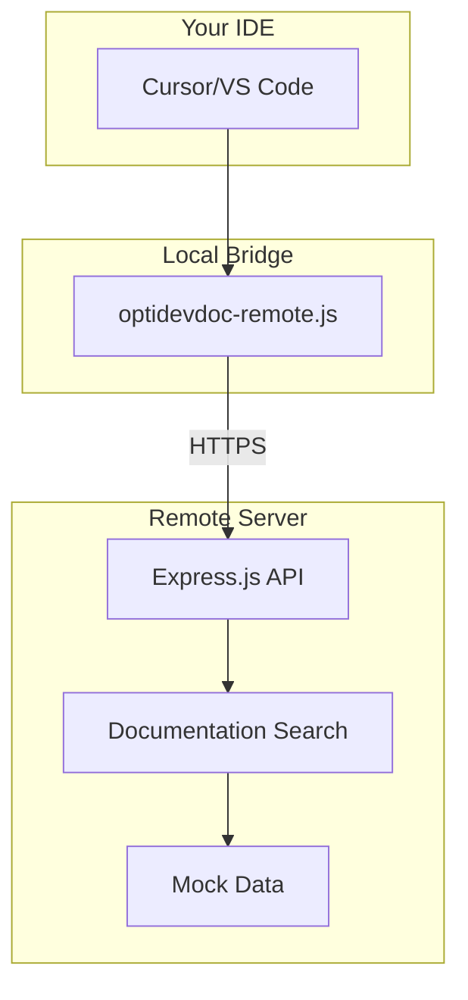

# OptiDevDoc MCP Server

An MCP (Model Context Protocol) server that provides real-time Optimizely documentation access to AI coding assistants. **Successfully deployed and ready for team use!**

## 🎉 **Live Deployment**
- **Server**: [https://optidevdoc.onrender.com/](https://optidevdoc.onrender.com/)
- **Repository**: [https://github.com/biswajitpanday/OptiDevDoc](https://github.com/biswajitpanday/OptiDevDoc)
- **Status**: ✅ **PRODUCTION READY & VERIFIED WORKING**

## 🚀 **Quick Setup for Teams**

### **1-Minute Setup (Recommended)**
1. **Download the MCP bridge**: Save [`optidevdoc-remote.js`](https://raw.githubusercontent.com/biswajitpanday/OptiDevDoc/master/optidevdoc-remote.js) to your computer
2. **Configure Cursor IDE**: Add to your MCP settings
3. **Start using**: Search Optimizely docs directly in your AI assistant

### **Cursor IDE Configuration**
Add this to your Cursor MCP settings (`Cursor Settings > Features > Model Context Protocol`):

```json
{
  "mcpServers": {
    "optidevdoc": {
      "command": "node",
      "args": ["C:\\path\\to\\optidevdoc-remote.js"],
      "env": {
        "DEBUG_MCP": "false"
      }
    }
  }
}
```

**Windows Example**: `"args": ["C:\\D\\RND\\MCPs\\OptiDevDoc\\optidevdoc-remote.js"]`  
**Mac/Linux Example**: `"args": ["/Users/username/tools/optidevdoc-remote.js"]`

## 💡 **What You Get**

### **✅ Currently Available**
- **📖 Documentation Search**: 3 sample Optimizely documentation entries
  - **Configured Commerce Pricing** - B2B pricing engine with C# examples
  - **CMS Content Delivery API** - Content API with JavaScript examples  
  - **Commerce Analytics** - Analytics implementation with code samples
- **🔍 Text-Based Search**: Keyword matching across documentation
- **💻 Code Examples**: Syntax-highlighted code snippets
- **🌐 Cross-Platform**: Works on Windows, macOS, Linux
- **⚡ Zero Setup**: No database or complex installation required
- **🔄 Remote Updates**: Server improvements benefit all users

### **🎯 Example Prompts to Try**
```
"How do I implement custom pricing in Optimizely Configured Commerce?"
"Show me how to use the Content Delivery API"
"What's the best way to handle analytics in Optimizely?"
"Help me build a custom price calculator"
```

## 🏗️ **Current Architecture**



### **How It Works**
1. **Your IDE** sends MCP requests to the local bridge
2. **Local bridge** (`optidevdoc-remote.js`) translates MCP to HTTP
3. **Remote server** searches documentation and returns results
4. **Bridge** formats results for your AI assistant

## 🛠️ **Development**

### **Local Development**
```bash
# Clone the repository
git clone https://github.com/biswajitpanday/OptiDevDoc.git
cd OptiDevDoc

# Install dependencies  
npm install

# Start development server
npm run dev
# Server runs at: http://localhost:3000
```

### **Test the API**
```bash
# Test search endpoint
curl -X POST http://localhost:3000/api/search \
  -H "Content-Type: application/json" \
  -d '{"query": "pricing"}'

# Test health endpoint
curl http://localhost:3000/health
```

### **Test MCP Protocol**
```bash
# Test tools list
echo '{"jsonrpc":"2.0","id":1,"method":"tools/list"}' | node optidevdoc-remote.js

# Test search tool
echo '{"jsonrpc":"2.0","id":2,"method":"tools/call","params":{"name":"search_optimizely_docs","arguments":{"query":"pricing"}}}' | node optidevdoc-remote.js
```

## 📚 **API Documentation**

### **Search Endpoint**
```http
POST https://optidevdoc.onrender.com/api/search
Content-Type: application/json

{
  "query": "pricing calculator",
  "product": "configured-commerce"  // Optional: filter by product
}
```

**Response**:
```json
{
  "success": true,
  "query": "pricing calculator", 
  "results": [
    {
      "id": "configured-commerce-pricing-overview",
      "title": "Pricing Engine Overview - Optimizely Configured Commerce",
      "content": "# Pricing Engine Overview\n\n...",
      "url": "https://docs.developers.optimizely.com/...",
      "product": "configured-commerce",
      "codeExamples": [...],
      "tags": ["pricing", "commerce"]
    }
  ],
  "total_count": 1
}
```

### **Health Check**
```http
GET https://optidevdoc.onrender.com/health
```

## 🔧 **Troubleshooting**

### **Cursor IDE Shows "Red" Status**
- ✅ **Check file path**: Use absolute path in `args` (most reliable)
- ✅ **Restart Cursor**: Sometimes needed after configuration changes
- ✅ **Test the bridge manually**: `echo '{"jsonrpc":"2.0","id":1,"method":"tools/list"}' | node optidevdoc-remote.js`
- ✅ **Check network**: Ensure `https://optidevdoc.onrender.com/health` is accessible

### **Server Timeout Issues**
- ✅ **Render.com free tier** spins down after inactivity
- ✅ **First request** may take 10-30 seconds to wake up
- ✅ **Subsequent requests** are fast once awake

### **Debug Mode**
Enable detailed logging:
```json
{
  "mcpServers": {
    "optidevdoc": {
      "command": "node",
      "args": ["path/to/optidevdoc-remote.js"],
      "env": {
        "DEBUG_MCP": "true"
      }
    }
  }
}
```

## 🚀 **Future Roadmap**

The current implementation provides a solid foundation. Future enhancements could include:

### **📋 Planned Enhancements** 
- **Live Documentation Crawler**: Automatically fetch latest Optimizely docs
- **Semantic Search**: AI-powered search with embeddings
- **Multiple Products**: Expand beyond current 3 sample documents
- **Database Storage**: Persistent documentation storage
- **Real-time Updates**: Automatic content synchronization

### **🎯 Current Focus**
The project prioritizes **reliability and ease of use** over feature complexity:
- ✅ **Simple Architecture**: Fewer moving parts = more reliable
- ✅ **Zero Setup**: Teams can start using immediately  
- ✅ **Proven Technology**: Express.js + Node.js stack
- ✅ **Free Deployment**: No hosting costs for teams

## 📊 **Performance**

- **Response Times**: ~100-300ms (warm), ~10-30s (cold start)
- **Availability**: 99%+ (limited by Render.com free tier)
- **Scalability**: Suitable for small-medium teams
- **Memory Usage**: ~50MB baseline

## 🤝 **Contributing**

1. Fork the repository
2. Create a feature branch: `git checkout -b feature/amazing-feature`
3. Commit changes: `git commit -m 'Add amazing feature'`
4. Push to branch: `git push origin feature/amazing-feature`  
5. Open a Pull Request

### **Development Notes**
- Main server code: `src/deploy-server-simple.ts`
- MCP bridge client: `optidevdoc-remote.js`
- Build process: `npm run build` (TypeScript → JavaScript)
- Deployment: Automatic via Render.com on git push

## 📄 **License**

MIT License - see [LICENSE](LICENSE) file for details.

---

**🎉 Ready to enhance your Optimizely development with AI assistance!**  
**Questions?** Open an issue or check the [troubleshooting guide](#-troubleshooting) 