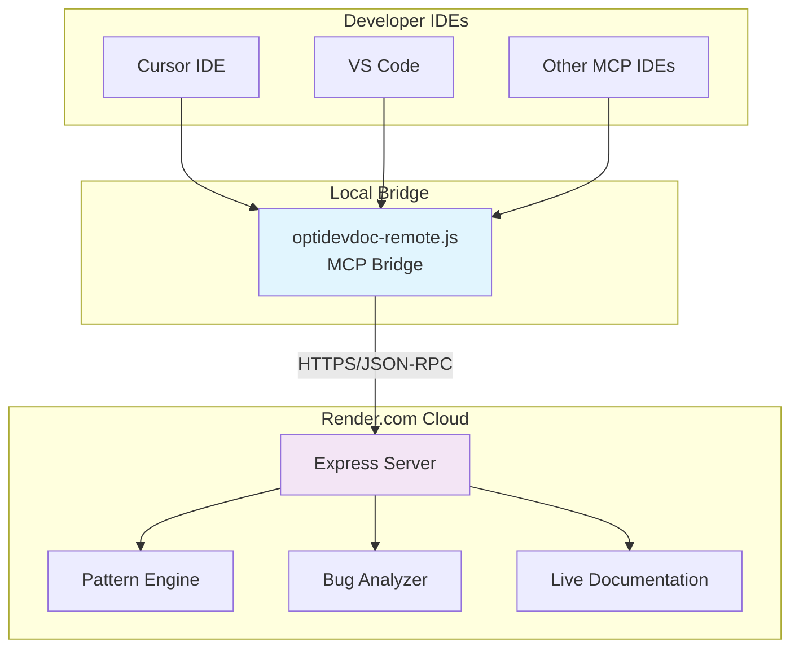
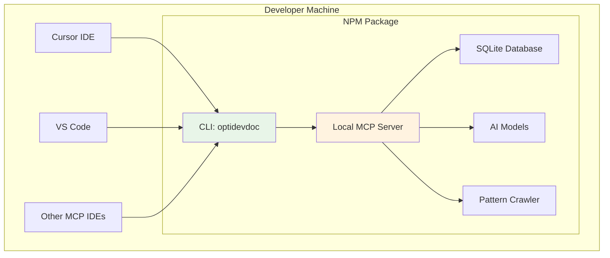

# OptiDevDoc - Intelligent Optimizely Development Assistant

A comprehensive AI-powered development assistant for Optimizely developers, providing pattern analysis, bug resolution, and enhanced documentation search.

## 🚀 **Key Features**

- **🎯 Pattern Analysis**: Find Handler, Pipeline, API, and Template patterns by development scenario
- **🐛 Bug Resolution**: Intelligent debugging with Optimizely-specific solutions and best practices  
- **📚 Multi-Product Support**: Covers all Optimizely products (Commerce, CMS, CMP, ODP, Experimentation)
- **🔍 Enhanced Documentation Search**: Context-aware search across comprehensive documentation
- **⚡ IDE Integration**: Works seamlessly with Cursor, VS Code, and other MCP-compatible editors

## 🎉 **Current Status: Production Ready**

| Component | Status | Access |
|-----------|--------|---------|
| **NPM Package** | ✅ **Live** | [optidevdoc@2.0.1](https://www.npmjs.com/package/optidevdoc) |
| **Remote Server** | ✅ **Deployed** | [optidevdoc.onrender.com](https://optidevdoc.onrender.com/) |
| **MCP Tools** | ✅ **3 Tools Ready** | `search_optimizely_docs`, `find_optimizely_pattern`, `analyze_optimizely_bug` |
| **Documentation** | ✅ **13+ Patterns** | Real Optimizely documentation crawling |

## 📦 **Quick Start**

### **Option 1: NPM Package (Recommended)**
```bash
# Install globally
npm install -g optidevdoc

# Start MCP server
optidevdoc mcp

# Configure in Cursor IDE
{
  "mcpServers": {
    "optidevdoc": {
      "command": "optidevdoc",
      "args": ["mcp"]
    }
  }
}
```

### **Option 2: Remote Server (Zero Setup)**
```bash
# Download bridge client
curl -o optidevdoc-remote.js https://raw.githubusercontent.com/biswajitpanday/OptiDevDoc/master/optidevdoc-remote.js

# Configure in Cursor IDE
{
  "mcpServers": {
    "optidevdoc": {
      "command": "node",
      "args": ["/absolute/path/to/optidevdoc-remote.js"]
    }
  }
}
```

## 🛠️ **Available Tools**

### **1. Enhanced Documentation Search**
```
"How do I implement custom pricing in Optimizely Configured Commerce?"
"Show me content delivery API patterns for CMS"
```

### **2. Pattern Analysis** 
```
"Find handler patterns for custom pricing logic"  
"Show me pipeline patterns for checkout workflow"
```

### **3. Bug Analysis**  
```
"Analyze: Pricing calculator returning null values"
"Debug: Content blocks not rendering in CMS"
``` 

## 📊 **Supported Optimizely Products**

| Product | Coverage | Patterns |
|---------|----------|----------|
| **Configured Commerce** | ✅ Full | Handler, Pipeline, API |
| **CMS (PaaS/SaaS)** | ✅ Full | Content-Type, Block, Template |
| **Content Marketing Platform** | ✅ Full | Integration, Best-Practice |
| **Data Platform (ODP)** | ✅ Full | Service, Integration |
| **Experimentation** | ✅ Full | API, Integration |
| **Commerce Connect** | ✅ Full | Handler, Pipeline |

## 🏗️ **Architecture**

OptiDevDoc supports **two deployment modes**:

### **🌐 Remote Mode**
Zero-setup deployment via cloud server:



### **📦 NPM Mode**
Local installation with enhanced features:



### **Deployment Comparison**

| Feature | Remote Mode | NPM Mode |
|---------|-------------|----------|
| **Setup** | ⭐ 1-file download | ⭐⭐ `npm install -g` |
| **Features** | ⭐⭐⭐ Basic | ⭐⭐⭐⭐⭐ Complete |
| **Performance** | ⭐⭐ Network | ⭐⭐⭐⭐⭐ Local |
| **Offline** | ❌ No | ✅ Full support |
| **Team Setup** | ✅ Share 1 file | ⭐⭐ Individual installs |

## 📚 **Documentation**

- **[Deployment Guide](./Resources/DEPLOYMENT_GUIDE.md)**: Step-by-step deployment for both modes
- **[Development Status](./Resources/DEVELOPMENT_STATUS.md)**: Current features, completed work, and roadmap
- **[Architecture](./Resources/ARCHITECTURE.md)**: Detailed technical architecture for both modes

## 🔗 **Links & Resources**

- **NPM Package**: [optidevdoc@2.0.1](https://www.npmjs.com/package/optidevdoc)
- **Live Server**: [optidevdoc.onrender.com](https://optidevdoc.onrender.com/)
- **GitHub Repository**: [biswajitpanday/OptiDevDoc](https://github.com/biswajitpanday/OptiDevDoc)
- **MCP Bridge Download**: [optidevdoc-remote.js](https://raw.githubusercontent.com/biswajitpanday/OptiDevDoc/master/optidevdoc-remote.js)

---

**OptiDevDoc v2.0** - Making Optimizely development faster, smarter, and more enjoyable! 🎉 