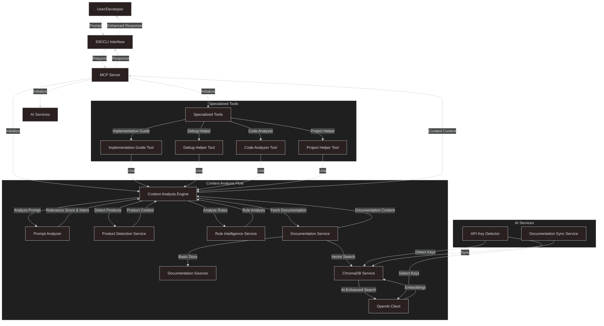

# Optivise

**Optivise** is an intelligent MCP (Model Context Protocol) tool that enhances AI-assisted Optimizely development. It analyzes developer prompts for Optimizely relevance and provides curated, contextual information to LLMs.

## Features

- **5 Specialized MCP Tools**:
  - `optidev_context_analyzer`: Enhanced context analysis with product detection
  - `optidev_implementation_guide`: Jira ticket analysis and implementation planning
  - `optidev_debug_helper`: Intelligent bug analysis and resolution
  - `optidev_code_analyzer`: Real-time code analysis and optimization
  - `optidev_project_helper`: Project setup, migration, and configuration assistance

- **AI-Powered Capabilities** (Optional):
  - OpenAI integration for embeddings and semantic search
  - ChromaDB vector database for documentation search
  - Intelligent documentation processing and curation
  - Graceful fallbacks when AI features unavailable

## Installation

```bash
# Install Optivise globally
npm install -g optivise

# Verify installation
optivise version
```

## IDE Configuration

### For Cursor IDE:

Create or update `.cursor/mcp.json` in your project:

```json
{
  "mcpServers": {
    "optivise": {
      "command": "npx",
      "args": ["optivise-mcp"]
    }
  }
}
```

### For VS Code:

Add to your VS Code settings:

```json
{
  "mcp.servers": [
    {
      "name": "optivise",
      "command": "npx",
      "args": ["optivise-mcp"]
    }
  ]
}
```

## Usage

```
@optidev_context_analyzer "How do I implement a custom handler chain in Optimizely Commerce?"
```

### AI Enhancement (Optional)

To enable AI-powered features:

```json
{
  "mcpServers": {
    "optivise": {
      "command": "npx",
      "args": ["optivise-mcp"],
      "env": {
        "OPENAI_API_KEY": "your-api-key-here"
      }
    }
  }
}
```

## Troubleshooting

### MCP Server Not Connecting
- Verify Node.js version: Ensure Node.js >= 18.0.0
- Restart IDE after configuration changes
- Check logs: Set `LOG_LEVEL=debug` for detailed logs

### Tools Not Available
- Verify configuration: Ensure `optivise-mcp` is correctly referenced
- Test connection: `npx @modelcontextprotocol/inspector npx optivise-mcp`

### Windows Path Issues
Use forward slashes or double backslashes in JSON:
```json
"args": ["optivise-mcp"]
```

## Enterprise Security & Privacy

- **End-to-End Encryption**: All data encrypted with AES-256-GCM
- **Role-Based Access Control**: Granular permissions system
- **Privacy-First Design**: Local-first processing and storage
- **GDPR Compliance**: Privacy controls and data anonymization

## Use Cases & Examples

### For Individual Developers
```
@optidev_implementation_guide "Implement customer loyalty points system"
@optidev_debug_helper "Cart total calculation incorrect after discount applied"
@optidev_code_analyzer "Review this handler for performance optimization"
```

### For Development Teams
```
@optidev_project_helper "Setup new Commerce + CMS integrated project"
@optidev_context_analyzer "Best practices for integrating Commerce with CMS"
```

## Data Flow Diagram



## Documentation & Support

- [Architecture Diagrams](docs/Architecture_Diagrams.md): System architecture and data flows
- [Product Requirements](docs/PRD.md): Complete product requirements and features
- [Software Requirements](docs/SRS.md): Technical specifications and interfaces
- [Project Plan](docs/Project_Plan.md): Development roadmap and timeline
- [Vision and Scope](docs/Vision_and_Scope.md): Project vision and objectives
- [Todo List](docs/TodoList.md): Implementation status and completed features
- [Claude Integration](CLAUDE.md): Guidance for Claude AI when working with this codebase

## Contact

- **Issues**: [GitHub Issues](https://github.com/optimizely/optivise/issues)
- **Community**: [Community Forum](https://community.optivise.dev)
- **Support**: [Enterprise Support](mailto:enterprise@optivise.dev)