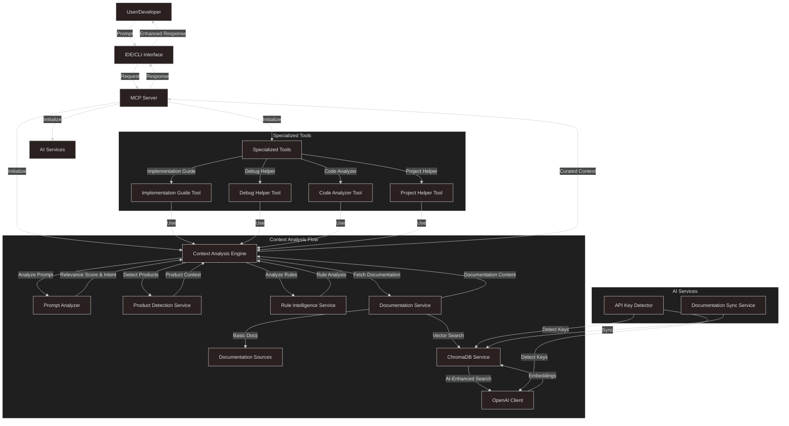

# Optivise

**Optivise** is an intelligent MCP (Model Context Protocol) tool that enhances AI-assisted Optimizely development. It analyzes developer prompts for Optimizely relevance and provides curated, contextual information to LLMs.

## Features (Current)

- **5 Specialized MCP Tools**:
  - `optidev_context_analyzer`: Enhanced context analysis with product detection
  - `optidev_implementation_guide`: Jira ticket analysis and implementation planning
  - `optidev_debug_helper`: Intelligent bug analysis and resolution
  - `optidev_code_analyzer`: Real-time code analysis and optimization
  - `optidev_project_helper`: Project setup, migration, and configuration assistance

- **AI-Powered Capabilities** (Optional):
  - OpenAI integration for embeddings and semantic search (optional)
  - ChromaDB vector database for documentation search (optional)
  - Deterministic relevance scoring with evidence and rules
  - Graceful fallbacks when AI features unavailable

- **Observability & Safety**:
  - Structured JSON logs on stderr with correlation IDs; MCP stdout clean
  - Log redaction, block sanitization (scripts/iframes/JS/data URIs), content size ceilings
  - Diagnostics with per-stage timings and relevance breakdown

## Installation

```bash
# Install Optivise globally
npm install -g optivise

# Verify installation
optivise version
```

## IDE Configuration

### For Cursor IDE:

Create or update `.cursor/mcp.json` in your project:

```json
{
  "mcpServers": {
    "optivise": {
      "command": "npx",
      "args": ["optivise-mcp"]
    }
  }
}
```

### For VS Code:

Add to your VS Code settings:

```json
{
  "mcp.servers": [
    {
      "name": "optivise",
      "command": "npx",
      "args": ["optivise-mcp"]
    }
  ]
}
```

## Usage

```
@optidev_context_analyzer "How do I implement a custom handler chain in Optimizely Commerce?"
```

### AI Enhancement (Optional)

To enable AI-powered features:

```json
{
  "mcpServers": {
    "optivise": {
      "command": "npx",
      "args": ["optivise-mcp"],
      "env": {
        "OPENAI_API_KEY": "your-api-key-here"
      }
    }
  }
}
```

## CLI Utilities

```bash
# Propose a consolidated .cursorrules from discovered rules (prints JSON with diff)
optivise-rules propose /path/to/project

# Write the proposed .cursorrules to the project root
optivise-rules propose /path/to/project --write

# Print version and service diagnostics (AI/Chroma/doc-sync availability)
optivise-diag

# Query local HTTP server health or readiness
optivise-health                   # defaults to http://localhost:3000/health
optivise-health --ready           # queries http://localhost:3000/ready
optivise-health --url=http://host:port/ready
```

## Environment Variables

- LOG_LEVEL: error|warn|info|debug (default: info)
- OPTIVISE_MODE: mcp|server (default: mcp)
- MAX_BLOCK_CHARS: max characters per context block (default: 5000)
- MAX_TOTAL_TOKENS: hard safety ceiling for context tokens (default: 4000)
- OPENAI_API_KEY: optional, enables AI-powered features
- CORS_ALLOW_ORIGINS: comma-separated allowed origins for HTTP server (default: *)
- REQUEST_TIMEOUT_MS: per-request timeout for /analyze (default: 15000)
- AUDIT_API_KEY: enables protected GET /audit endpoint when OPTIVISE_AUDIT=true
- OPTIVISE_AUDIT: set to 'true' to enable in-memory audit trail (requires AUDIT_API_KEY for access)

## Troubleshooting

### MCP Server Not Connecting
- Verify Node.js version: Ensure Node.js >= 18.0.0
- Restart IDE after configuration changes
- Check logs: Set `LOG_LEVEL=debug` for detailed logs

### Tools Not Available
- Verify configuration: Ensure `optivise-mcp` is correctly referenced
- Test connection: `npx @modelcontextprotocol/inspector npx optivise-mcp`

### Windows Path Issues
Use forward slashes or double backslashes in JSON:
```json
"args": ["optivise-mcp"]
```

## Render Deployment (Example)

See `render.yaml` for a minimal configuration:

```yaml
services:
  - type: web
    name: optivise
    env: node
    plan: free
    buildCommand: npm install && npm run build
    startCommand: npm start
    envVars:
      - key: NODE_ENV
        value: production
      - key: OPTIVISE_MODE
        value: server
      - key: OPTIDEV_DEBUG
        value: false
      - key: CORS_ALLOW_ORIGINS
        value: https://yourdomain.com
    healthCheckPath: /health
```

After deployment:
- `GET /health` for liveness
- `GET /ready` for feature matrix + circuit states (OpenAI/Chroma)
- Use `optivise-health` locally to check `http://localhost:3000/health`

## Audit Trail (Opt-in)

- Enable: set `OPTIVISE_AUDIT=true` and set a strong `AUDIT_API_KEY`.
- Fetch recent events:

```bash
curl -H "Authorization: Bearer $AUDIT_API_KEY" http://localhost:3000/audit | jq
```

## Security & Privacy (Current)

- Log redaction (API keys/tokens/passwords), correlation IDs, MCP stdout kept clean
- Output sanitization and size bounds in formatter; relevance-aware truncation
- Opt-in in-memory audit trail for tool invocations (protected endpoint)
- Circuit breakers and backoff for AI/Chroma integrations; CI `npm audit` + CycloneDX SBOM

Planned (not yet implemented): stronger PII detection, allow-listed HTML sanitization, signed releases, and comprehensive policy scans (e.g., OSV).

## Use Cases & Examples

### For Individual Developers
```
@optidev_implementation_guide "Implement customer loyalty points system"
@optidev_debug_helper "Cart total calculation incorrect after discount applied"
@optidev_code_analyzer "Review this handler for performance optimization"
```

### For Development Teams
```
@optidev_project_helper "Setup new Commerce + CMS integrated project"
@optidev_context_analyzer "Best practices for integrating Commerce with CMS"
```

## Data Flow Diagram



## Documentation & Support

- [IDE Agent Integration](docs/ide_agent_integration.md): How to assemble prompts and previews in Cursor/VS Code
- [Developer Guide](docs/Developer_Guide.md): How to develop, run, test, and integrate Optivise locally
- [Architecture Diagrams](docs/Architecture_Diagrams.md): System architecture and data flows
- [Product Requirements](docs/PRD.md): Complete product requirements and features
- [Software Requirements](docs/SRS.md): Technical specifications and interfaces
- [Project Plan](docs/Project_Plan.md): Development roadmap and timeline
- [Vision and Scope](docs/Vision_and_Scope.md): Project vision and objectives
- [Todo List](docs/TodoList.md): Implementation status and completed features
- [Claude Integration](CLAUDE.md): Guidance for Claude AI when working with this codebase

## Contact

- **Issues**: [GitHub Issues](https://github.com/optimizely/optivise/issues)
- **Support**: [Enterprise Support](mailto:biswajitmailid@gmail.com)