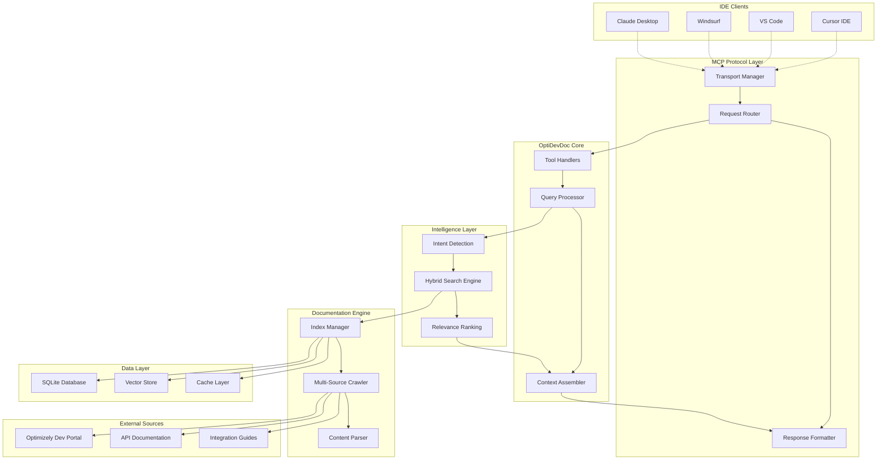

# OptiDevDoc MCP Tool - Technical Architecture

## System Overview

OptiDevDoc implements a sophisticated documentation-aware MCP server designed specifically for Optimizely development workflows. The architecture emphasizes performance, reliability, and intelligent context assembly while maintaining simplicity for end users.

## High-Level Architecture



## Core Components

### 1. MCP Protocol Layer (`src/mcp/`)

**Purpose**: Handles all MCP protocol communication and transport management

#### Transport Manager (`transport-manager.ts`)
```typescript
interface TransportManager {
  stdio: StdioTransport;
  http: HttpTransport;
  sse: ServerSentEventTransport;
  
  initialize(config: TransportConfig): Promise<void>;
  route(request: MCPRequest): Promise<MCPResponse>;
  shutdown(): Promise<void>;
}
```

**Responsibilities**:
- Multi-transport support (stdio for local, HTTP/SSE for remote)
- Connection lifecycle management
- Request/response serialization
- Error handling and retry logic
- Performance monitoring and metrics

#### Request Router (`request-router.ts`)
```typescript
interface RequestRouter {
  registerTool(name: string, handler: ToolHandler): void;
  route(request: MCPRequest): Promise<MCPResponse>;
  validateRequest(request: MCPRequest): ValidationResult;
}
```

**Features**:
- Dynamic tool registration and discovery
- Request validation and sanitization
- Rate limiting and throttling
- Request context preservation
- Audit logging for debugging

### 2. Tool Handlers (`src/tools/`)

**Purpose**: Implements Optimizely-specific MCP tools

#### Core Tools

##### `resolve-optimizely-id.ts`
```typescript
interface ResolveOptimizelyIdTool {
  name: 'resolve-optimizely-id';
  description: 'Maps queries to specific Optimizely component identifiers';
  inputSchema: {
    query: string;           // User's natural language query
    context?: string;        // Additional context about the query
    products?: string[];     // Preferred Optimizely products
  };
  outputSchema: {
    matches: OptimizelyComponent[];
    confidence: number;
    suggestions: string[];
  };
}
```

**Algorithm**:
1. **Query Analysis**: Extract keywords, detect intent, classify query type
2. **Product Mapping**: Identify relevant Optimizely products based on terminology
3. **Component Resolution**: Map to specific APIs, guides, or patterns
4. **Confidence Scoring**: Rank matches by relevance and accuracy

##### `get-optimizely-docs.ts`
```typescript
interface GetOptimizelyDocsTool {
  name: 'get-optimizely-docs';
  description: 'Retrieves relevant Optimizely documentation';
  inputSchema: {
    componentId: string;     // From resolve-optimizely-id
    topic?: string;          // Specific focus area
    includeExamples?: boolean;
    maxTokens?: number;
  };
  outputSchema: {
    documentation: DocumentationContext;
    codeExamples: CodeExample[];
    relatedTopics: string[];
    sourceUrls: string[];
  };
}
```

**Features**:
- Multi-source documentation aggregation
- Code example extraction and formatting
- Version-specific content selection
- Related content suggestions
- Response optimization for AI consumption

### 3. Intelligence Layer (`src/intelligence/`)

**Purpose**: Provides smart query processing and content understanding

#### Intent Detection Engine (`intent-detector.ts`)
```typescript
interface IntentDetector {
  detectIntent(query: string): QueryIntent;
  classifyQueryType(query: string): QueryType;
  extractEntities(query: string): OptimizelyEntity[];
}

enum QueryType {
  API_REFERENCE = 'api-reference',
  CONFIGURATION = 'configuration',
  TROUBLESHOOTING = 'troubleshooting',
  INTEGRATION = 'integration',
  BEST_PRACTICES = 'best-practices',
  EXAMPLE_CODE = 'example-code'
}
```

**Machine Learning Approach**:
- Pre-trained models for general intent detection
- Optimizely-specific terminology dictionary
- Pattern recognition for common developer queries
- Context-aware entity extraction

#### Hybrid Search Engine (`search-engine.ts`)
```typescript
interface HybridSearchEngine {
  keywordSearch(query: string): SearchResult[];
  semanticSearch(query: string): SearchResult[];
  hybridSearch(query: string, weights: SearchWeights): SearchResult[];
  rerank(results: SearchResult[], context: QueryContext): SearchResult[];
}

interface SearchWeights {
  keyword: number;         // 0.0 - 1.0
  semantic: number;        // 0.0 - 1.0
  recency: number;         // 0.0 - 1.0
  popularity: number;      // 0.0 - 1.0
}
```

**Search Strategy**:
1. **Keyword Search**: TF-IDF with Optimizely terminology boosting
2. **Semantic Search**: Vector similarity using embeddings
3. **Hybrid Combination**: Weighted score fusion
4. **Re-ranking**: Context-aware result ordering
5. **Filtering**: Remove duplicates and low-quality content

### 4. Documentation Engine (`src/engine/`)

**Purpose**: Manages documentation crawling, parsing, and indexing

#### Multi-Source Crawler (`crawler.ts`)
```typescript
interface DocumentationCrawler {
  sources: DocumentationSource[];
  
  crawl(source: DocumentationSource): Promise<CrawlResult>;
  schedule(interval: Duration): void;
  monitor(): CrawlerStatus;
}

interface DocumentationSource {
  name: string;
  baseUrl: string;
  authentication?: AuthConfig;
  rateLimit: RateLimitConfig;
  parser: ParserConfig;
}
```

**Crawling Strategy**:
- **Polite Crawling**: Respect robots.txt and rate limits
- **Incremental Updates**: Only fetch changed content
- **Content Validation**: Verify documentation quality and completeness
- **Error Recovery**: Robust handling of network and parsing errors
- **Monitoring**: Track source availability and changes

#### Content Parser (`parser.ts`)
```typescript
interface ContentParser {
  parseApiDocumentation(html: string): ApiDocumentation;
  parseGuide(html: string): Guide;
  extractCodeExamples(html: string): CodeExample[];
  extractMetadata(html: string): DocumentMetadata;
}

interface ApiDocumentation {
  name: string;
  description: string;
  parameters: Parameter[];
  returnType: TypeDefinition;
  examples: CodeExample[];
  relatedMethods: string[];
}
```

**Parsing Features**:
- **Multi-format Support**: HTML, Markdown, JSON schema
- **Code Example Extraction**: Syntax highlighting and validation
- **Metadata Extraction**: Version info, categories, tags
- **Link Resolution**: Internal and external reference mapping
- **Content Normalization**: Consistent formatting across sources

### 5. Data Layer (`src/data/`)

**Purpose**: Efficient storage and retrieval of documentation content

#### Database Schema (SQLite)

```sql
-- Core documentation storage
CREATE TABLE documents (
    id INTEGER PRIMARY KEY AUTOINCREMENT,
    source_id VARCHAR(50) NOT NULL,
    product VARCHAR(50) NOT NULL,
    category VARCHAR(50) NOT NULL,
    title TEXT NOT NULL,
    url TEXT UNIQUE NOT NULL,
    content TEXT NOT NULL,
    summary TEXT,
    metadata JSON,
    version VARCHAR(20),
    last_updated TIMESTAMP DEFAULT CURRENT_TIMESTAMP,
    last_crawled TIMESTAMP DEFAULT CURRENT_TIMESTAMP,
    content_hash VARCHAR(64) NOT NULL,
    INDEX idx_product_category (product, category),
    INDEX idx_version (version),
    INDEX idx_last_updated (last_updated)
);

-- API-specific documentation
CREATE TABLE api_documentation (
    id INTEGER PRIMARY KEY AUTOINCREMENT,
    document_id INTEGER NOT NULL,
    api_name VARCHAR(100) NOT NULL,
    namespace VARCHAR(100),
    method_type VARCHAR(20),
    parameters JSON,
    return_type VARCHAR(100),
    examples JSON,
    deprecated BOOLEAN DEFAULT FALSE,
    since_version VARCHAR(20),
    FOREIGN KEY (document_id) REFERENCES documents(id),
    INDEX idx_api_name (api_name),
    INDEX idx_namespace (namespace)
);

-- Code examples with enhanced metadata
CREATE TABLE code_examples (
    id INTEGER PRIMARY KEY AUTOINCREMENT,
    document_id INTEGER NOT NULL,
    title VARCHAR(200),
    description TEXT,
    language VARCHAR(50) NOT NULL,
    code TEXT NOT NULL,
    tags JSON,
    complexity_level INTEGER, -- 1-5 scale
    use_case VARCHAR(100),
    framework_version VARCHAR(50),
    FOREIGN KEY (document_id) REFERENCES documents(id),
    INDEX idx_language (language),
    INDEX idx_use_case (use_case)
);

-- Enhanced search index
CREATE TABLE search_index (
    id INTEGER PRIMARY KEY AUTOINCREMENT,
    document_id INTEGER NOT NULL,
    term VARCHAR(100) NOT NULL,
    term_type VARCHAR(50), -- 'keyword', 'api', 'class', 'method', etc.
    frequency INTEGER NOT NULL,
    position_weights JSON, -- Position-based importance scores
    context_snippet TEXT,
    FOREIGN KEY (document_id) REFERENCES documents(id),
    INDEX idx_term (term),
    INDEX idx_term_type (term_type)
);

-- Vector embeddings for semantic search
CREATE TABLE embeddings (
    id INTEGER PRIMARY KEY AUTOINCREMENT,
    document_id INTEGER NOT NULL,
    chunk_index INTEGER NOT NULL,
    chunk_text TEXT NOT NULL,
    embedding BLOB NOT NULL, -- Serialized float array
    chunk_type VARCHAR(50), -- 'summary', 'api', 'example', 'guide'
    token_count INTEGER,
    FOREIGN KEY (document_id) REFERENCES documents(id),
    INDEX idx_document_chunk (document_id, chunk_index),
    INDEX idx_chunk_type (chunk_type)
);

-- User feedback and analytics
CREATE TABLE query_analytics (
    id INTEGER PRIMARY KEY AUTOINCREMENT,
    query_hash VARCHAR(64) NOT NULL,
    query_type VARCHAR(50),
    response_time_ms INTEGER,
    result_count INTEGER,
    user_feedback INTEGER, -- 1-5 rating
    clicked_results JSON,
    timestamp TIMESTAMP DEFAULT CURRENT_TIMESTAMP,
    INDEX idx_timestamp (timestamp),
    INDEX idx_query_type (query_type)
);
```

#### Vector Store Implementation (`vector-store.ts`)
```typescript
interface VectorStore {
  addEmbedding(docId: string, text: string, embedding: number[]): Promise<void>;
  search(queryEmbedding: number[], limit: number, threshold: number): Promise<SearchResult[]>;
  updateEmbedding(docId: string, embedding: number[]): Promise<void>;
  deleteEmbeddings(docId: string): Promise<void>;
}

class OptimizedVectorStore implements VectorStore {
  private embeddings: Map<string, Float32Array> = new Map();
  private faissIndex: any; // FAISS index for fast similarity search
  private dimension: number = 384; // OpenAI text-embedding-ada-002 dimension
  
  constructor() {
    this.initializeFaissIndex();
  }
  
  private initializeFaissIndex(): void {
    const faiss = require('faiss-node');
    this.faissIndex = new faiss.IndexFlatIP(this.dimension); // Inner product for cosine similarity
  }
  
  async addEmbedding(docId: string, text: string, embedding: number[]): Promise<void> {
    const embeddingArray = new Float32Array(embedding);
    this.embeddings.set(docId, embeddingArray);
    this.faissIndex.add(embeddingArray);
  }
  
  async search(queryEmbedding: number[], limit: number = 10, threshold: number = 0.7): Promise<SearchResult[]> {
    try {
      const queryArray = new Float32Array(queryEmbedding);
      const results = this.faissIndex.search(queryArray, limit);
      
      return results
        .filter(result => result.distance > threshold)
        .map(result => ({
          docId: Array.from(this.embeddings.keys())[result.label],
          score: result.distance,
          text: this.getTextForDocId(Array.from(this.embeddings.keys())[result.label])
        }));
    } catch (error) {
      console.error('Vector search failed:', error);
      return []; // Graceful degradation
    }
  }
  
  private getTextForDocId(docId: string): string {
    // Implementation to retrieve original text for document ID
    return ''; // Placeholder
  }
}
```

### 6. Configuration System (`src/config/`)

**Purpose**: Manages user preferences and system configuration

#### Configuration Schema
```typescript
interface OptiDevDocConfig {
  // Core settings
  server: {
    transport: 'stdio' | 'http' | 'sse';
    port?: number;
    host?: string;
    cors?: CorsConfig;
  };
  
  // User preferences
  preferences: {
    autoTrigger: boolean;
    triggerKeywords: string[];
    maxResponseTokens: number;
    responseFormat: 'detailed' | 'concise' | 'code-focused';
    preferredProducts: OptimizelyProduct[];
    cacheEnabled: boolean;
    analyticsEnabled: boolean;
  };
  
  // Search configuration
  search: {
    hybridWeights: SearchWeights;
    maxResults: number;
    semanticThreshold: number;
    timeoutMs: number;
    cacheSearchResults: boolean;
  };
  
  // Documentation sources
  sources: {
    [key: string]: DocumentationSourceConfig;
  };
  
  // Performance tuning
  performance: {
    maxConcurrentRequests: number;
    cacheSize: number;
    embeddingDimensions: number;
    indexRefreshIntervalHours: number;
  };
  
  // Team settings (for shared deployments)
  team?: {
    teamId: string;
    sharedConfig: Partial<OptiDevDocConfig>;
    customTerminology: Record<string, string>;
    restrictedProducts?: OptimizelyProduct[];
  };
}
```

## Communication Patterns & Data Flow

### 1. Query Processing Flow
```
IDE Query → Transport Layer → Request Router → Tool Handler → Intent Detection → 
Query Processing → Hybrid Search → Context Assembly → Response Formatting → IDE
```

### 2. Documentation Update Flow
```
Scheduler → Crawler → Content Parser → Change Detection → Index Update → 
Cache Invalidation → Analytics Update
```

### 3. Search & Retrieval Flow
```
User Query → Intent Classification → Keyword Extraction → Parallel Search:
├─ Keyword Search → TF-IDF Scoring
├─ Semantic Search → Vector Similarity
└─ API Search → Exact Matching
→ Result Fusion → Re-ranking → Context Assembly → Response
```

## Performance Architecture

### Caching Strategy
```typescript
interface CacheLayer {
  queryCache: LRUCache<string, SearchResult[]>;
  documentCache: LRUCache<string, Document>;
  embeddingCache: LRUCache<string, number[]>;
  
  // Multi-level cache with different TTLs
  get<T>(key: string, level: CacheLevel): Promise<T | null>;
  set<T>(key: string, value: T, level: CacheLevel, ttl?: number): Promise<void>;
}

enum CacheLevel {
  MEMORY = 'memory',      // 5 minutes TTL
  DISK = 'disk',          // 1 hour TTL
  REMOTE = 'remote'       // 24 hours TTL
}
```

### Performance Optimizations
1. **Query Optimization**:
   - Query result caching with intelligent invalidation
   - Response compression for large documentation
   - Streaming responses for real-time feedback

2. **Index Optimization**:
   - Incremental indexing to minimize rebuild time
   - Parallel processing for embedding generation
   - Optimized database queries with proper indexing

3. **Memory Management**:
   - Lazy loading of embeddings and large documents
   - Memory-mapped file access for vector operations
   - Garbage collection optimization for long-running processes

## Security & Privacy Architecture

### Data Security
```typescript
interface SecurityConfig {
  encryption: {
    atRest: boolean;        // Encrypt local database
    inTransit: boolean;     // TLS for remote communication
    apiKeys: boolean;       // Encrypt stored API keys
  };
  
  access: {
    rateLimiting: RateLimitConfig;
    authentication?: AuthConfig;
    authorization?: AuthzConfig;
  };
  
  privacy: {
    logUserQueries: boolean;
    anonymizeAnalytics: boolean;
    dataRetention: Duration;
  };
}
```

### Privacy Considerations
- **No Personal Data Storage**: Only public documentation content
- **Query Anonymization**: Hash queries for analytics without storing content
- **Local-First**: Sensitive data stays on user's machine
- **Audit Logging**: Track access patterns without exposing query content

## Deployment Architecture

### Local Deployment
```
User's Machine:
├─ OptiDevDoc MCP Server (stdio)
├─ SQLite Database (~100MB)
├─ Vector Index (~50MB)
├─ Configuration Files
└─ Cache Directory (~200MB)
```

### Remote Deployment (Render.com)
```
Render.com Container:
├─ Node.js Application Server
├─ PostgreSQL Database (shared)
├─ Redis Cache Layer
├─ File Storage for indexes
└─ Monitoring & Health Checks
```

## Monitoring & Observability

### Metrics Collection
```typescript
interface MetricsCollector {
  performance: {
    responseTime: Histogram;
    throughput: Counter;
    errorRate: Counter;
    cacheHitRate: Gauge;
  };
  
  usage: {
    activeUsers: Gauge;
    queryTypes: Counter;
    productUsage: Counter;
    featureAdoption: Gauge;
  };
  
  system: {
    memoryUsage: Gauge;
    cpuUtilization: Gauge;
    diskSpace: Gauge;
    networkLatency: Histogram;
  };
}
```

### Health Monitoring
```typescript
interface HealthCheck {
  database: () => Promise<HealthStatus>;
  documentationSources: () => Promise<HealthStatus>;
  searchIndex: () => Promise<HealthStatus>;
  cache: () => Promise<HealthStatus>;
  memory: () => Promise<HealthStatus>;
}
```

## Scalability Considerations

### Horizontal Scaling
- **Stateless Server Design**: No session state in server instances
- **Database Read Replicas**: Scale read operations independently
- **Microservice Architecture**: Separate crawling from serving
- **Load Balancing**: Distribute requests across multiple instances

### Vertical Scaling
- **Memory Optimization**: Efficient data structures and caching
- **CPU Optimization**: Parallel processing for search operations
- **I/O Optimization**: Async operations and connection pooling
- **Storage Optimization**: Compressed indexes and efficient schemas

## Error Handling & Resilience

### Comprehensive Error Handling Architecture

#### Circuit Breaker Pattern Implementation
```typescript
class CircuitBreaker {
  private failures: number = 0;
  private lastFailure: Date | null = null;
  private state: 'CLOSED' | 'OPEN' | 'HALF_OPEN' = 'CLOSED';
  
  constructor(
    private failureThreshold: number = 5,
    private timeoutMs: number = 60000,
    private resetTimeoutMs: number = 30000
  ) {}
  
  async execute<T>(operation: () => Promise<T>): Promise<T> {
    if (this.state === 'OPEN') {
      if (Date.now() - this.lastFailure!.getTime() > this.resetTimeoutMs) {
        this.state = 'HALF_OPEN';
      } else {
        throw new Error('Circuit breaker is OPEN');
      }
    }
    
    try {
      const result = await Promise.race([
        operation(),
        new Promise<never>((_, reject) => 
          setTimeout(() => reject(new Error('Operation timeout')), this.timeoutMs)
        )
      ]);
      
      this.onSuccess();
      return result;
    } catch (error) {
      this.onFailure();
      throw error;
    }
  }
  
  private onSuccess(): void {
    this.failures = 0;
    this.state = 'CLOSED';
  }
  
  private onFailure(): void {
    this.failures++;
    this.lastFailure = new Date();
    
    if (this.failures >= this.failureThreshold) {
      this.state = 'OPEN';
    }
  }
}
```

#### Retry Mechanism with Exponential Backoff
```typescript
class RetryManager {
  async executeWithRetry<T>(
    operation: () => Promise<T>,
    maxAttempts: number = 3,
    baseDelayMs: number = 1000
  ): Promise<T> {
    let lastError: Error;
    
    for (let attempt = 1; attempt <= maxAttempts; attempt++) {
      try {
        return await operation();
      } catch (error) {
        lastError = error as Error;
        
        if (attempt === maxAttempts) {
          throw lastError;
        }
        
        const delay = baseDelayMs * Math.pow(2, attempt - 1);
        await this.sleep(delay);
      }
    }
    
    throw lastError!;
  }
  
  private sleep(ms: number): Promise<void> {
    return new Promise(resolve => setTimeout(resolve, ms));
  }
}
```

#### Error Classification and Handling
```typescript
enum ErrorType {
  NETWORK_ERROR = 'NETWORK_ERROR',
  TIMEOUT_ERROR = 'TIMEOUT_ERROR',
  AUTHENTICATION_ERROR = 'AUTHENTICATION_ERROR',
  RATE_LIMIT_ERROR = 'RATE_LIMIT_ERROR',
  PARSING_ERROR = 'PARSING_ERROR',
  VALIDATION_ERROR = 'VALIDATION_ERROR',
  INTERNAL_ERROR = 'INTERNAL_ERROR'
}

class ErrorHandler {
  private circuitBreaker = new CircuitBreaker();
  private retryManager = new RetryManager();
  
  async handleError(error: Error, context: string): Promise<ErrorResponse> {
    const errorType = this.classifyError(error);
    const errorId = this.generateErrorId();
    
    // Log error with context
    console.error(`[${errorId}] ${errorType} in ${context}:`, error);
    
    switch (errorType) {
      case ErrorType.NETWORK_ERROR:
        return this.handleNetworkError(error, errorId);
      
      case ErrorType.TIMEOUT_ERROR:
        return this.handleTimeoutError(error, errorId);
      
      case ErrorType.RATE_LIMIT_ERROR:
        return this.handleRateLimitError(error, errorId);
      
      case ErrorType.AUTHENTICATION_ERROR:
        return this.handleAuthError(error, errorId);
      
      default:
        return this.handleGenericError(error, errorId);
    }
  }
  
  private classifyError(error: Error): ErrorType {
    if (error.message.includes('timeout')) return ErrorType.TIMEOUT_ERROR;
    if (error.message.includes('network')) return ErrorType.NETWORK_ERROR;
    if (error.message.includes('rate limit')) return ErrorType.RATE_LIMIT_ERROR;
    if (error.message.includes('auth')) return ErrorType.AUTHENTICATION_ERROR;
    return ErrorType.INTERNAL_ERROR;
  }
  
  private handleNetworkError(error: Error, errorId: string): ErrorResponse {
    return {
      success: false,
      errorId,
      message: 'Network connectivity issue. Using cached results.',
      fallbackStrategy: 'cache',
      retryAfter: 30
    };
  }
  
  private handleTimeoutError(error: Error, errorId: string): ErrorResponse {
    return {
      success: false,
      errorId,
      message: 'Request timed out. Please try again.',
      fallbackStrategy: 'retry',
      retryAfter: 5
    };
  }
  
  private handleRateLimitError(error: Error, errorId: string): ErrorResponse {
    return {
      success: false,
      errorId,
      message: 'Rate limit exceeded. Please wait before trying again.',
      fallbackStrategy: 'wait',
      retryAfter: 60
    };
  }
  
  private generateErrorId(): string {
    return Date.now().toString(36) + Math.random().toString(36).substr(2);
  }
}
```

### Fault Tolerance Configuration
```typescript
interface ResilienceConfig {
  circuitBreaker: {
    failureThreshold: number;
    timeoutMs: number;
    resetTimeoutMs: number;
  };
  
  retry: {
    maxAttempts: number;
    backoffStrategy: 'exponential' | 'linear';
    baseDelayMs: number;
  };
  
  fallback: {
    cachedResults: boolean;
    defaultResponses: boolean;
    degradedMode: boolean;
  };
  
  monitoring: {
    errorRateThreshold: number;
    healthCheckInterval: number;
    alertingEnabled: boolean;
  };
}
```

### Error Recovery Strategies
- **Graceful Degradation**: Provide cached results when sources are unavailable
- **Automatic Recovery**: Self-healing mechanisms for common failures
- **Failover Strategies**: Multiple documentation sources for redundancy
- **User Communication**: Clear error messages with suggested actions
- **Circuit Breaking**: Prevent cascade failures with automatic circuit breakers
- **Retry Logic**: Smart retry with exponential backoff for transient failures
- **Health Monitoring**: Continuous health checks with automated alerting 