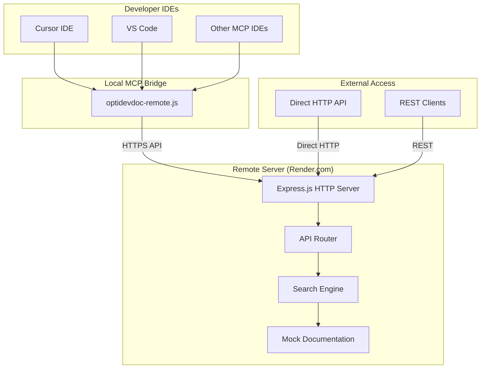
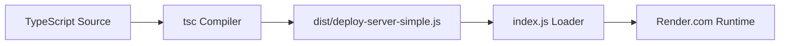
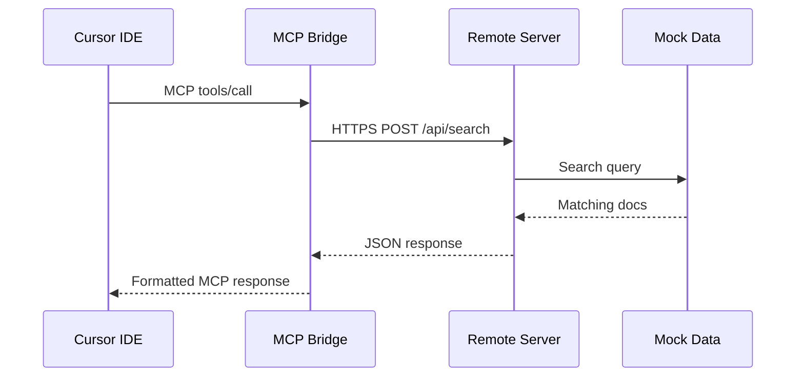

# OptiDevDoc MCP Tool - Implemented Architecture

## System Overview

OptiDevDoc is a **successfully deployed** MCP (Model Context Protocol) server that provides real-time Optimizely documentation access to AI coding assistants. The current implementation prioritizes **simplicity, reliability, and zero-setup team deployment**.

**Live Implementation**: [https://optidevdoc.onrender.com/](https://optidevdoc.onrender.com/)

## 🏗️ **Current Architecture (Implemented)**



## 🎯 **Implemented Components**

### 1. **Remote MCP Bridge** (`optidevdoc-remote.js`)

**Purpose**: Local MCP protocol bridge that connects IDEs to the remote server

```javascript
// Core MCP methods implemented
const mcpMethods = {
  'initialize': () => ({ protocolVersion: '2024-11-05', capabilities: {...} }),
  'tools/list': () => ({ tools: [{ name: 'search_optimizely_docs', ... }] }),
  'tools/call': (params) => callRemoteAPI(params.arguments.query),
  'ping': () => ({})
};
```

**Key Features**:
- ✅ **MCP Protocol Compliance**: Full initialize, tools/list, tools/call support
- ✅ **Remote Communication**: HTTPS requests to deployed server
- ✅ **Error Handling**: Timeout, retry, and clear error messages
- ✅ **Response Formatting**: Optimized for AI consumption
- ✅ **Zero Dependencies**: Uses only Node.js built-in modules
- ✅ **Debug Mode**: Optional verbose logging with `DEBUG_MCP=true`

### 2. **HTTP API Server** (`src/deploy-server-simple.ts`)

**Purpose**: Remote Express.js server providing documentation search capabilities

```typescript
// Actual server endpoints
const endpoints = {
  'GET /health': () => ({ status: 'healthy', uptime: process.uptime() }),
  'GET /api/docs': () => ({ /* API documentation */ }),
  'POST /api/search': (query) => searchMockDocumentation(query),
  'GET /': () => ({ /* server info */ })
};
```

**Technical Stack**:
- ✅ **Express.js**: Lightweight HTTP framework
- ✅ **CORS**: Cross-origin resource sharing
- ✅ **Mock Data**: 3 sample Optimizely documentation entries
- ✅ **Text Search**: Simple keyword-based search
- ✅ **Error Handling**: Graceful error responses
- ✅ **Health Monitoring**: Status and uptime tracking

### 3. **Mock Documentation Database**

**Current Content**:
1. **Configured Commerce Pricing** - B2B pricing engine with C# examples
2. **CMS Content Delivery API** - Content API with JavaScript examples  
3. **Commerce Analytics** - Analytics implementation with code samples

**Structure**:
```javascript
const mockDoc = {
  id: 'unique-identifier',
  title: 'Documentation Title',
  content: '# Markdown content with code examples',
  url: 'https://docs.developers.optimizely.com/...',
  product: 'configured-commerce',
  category: 'developer-guide',
  codeExamples: [{ language: 'csharp', code: '...', description: '...' }],
  tags: ['pricing', 'commerce'],
  breadcrumb: ['Home', 'Commerce', 'Pricing']
};
```

## 🚀 **Deployment Architecture**

### **Build Process**


### **Request Flow**


## 📊 **Current Capabilities & Limitations**

### **✅ Working Features**
- **MCP Integration**: Full protocol support for Cursor IDE
- **Remote Deployment**: Zero-config team setup
- **Documentation Search**: Text-based search across mock data
- **Code Examples**: Syntax-highlighted code snippets
- **Health Monitoring**: Server status and uptime tracking
- **Error Handling**: Graceful degradation and clear messages
- **Cross-Platform**: Windows, macOS, Linux support

### **📋 Current Limitations (Future Opportunities)**
- **Data Source**: Uses mock data instead of live documentation
- **Search Method**: Simple text matching (no semantic search)
- **Content Volume**: Only 3 sample documents
- **Real-time Updates**: Manual data updates required
- **Advanced Features**: No database, crawler, or AI embeddings

## 🔧 **Technical Decisions**

### **Why Simple Architecture?**
1. **Rapid Deployment**: Focus on working solution over feature completeness
2. **Reliability**: Fewer moving parts = fewer failure points  
3. **Team Adoption**: Zero-setup barrier for new developers
4. **Maintainability**: Easy to understand and modify
5. **Cost Efficiency**: Free tier deployment on Render.com

### **Future Evolution Path**
The current architecture provides a solid foundation for incremental enhancement:
1. **Phase 1** ✅: Simple HTTP server with mock data (COMPLETED)
2. **Phase 2** 📋: Add live documentation crawler
3. **Phase 3** 📋: Implement semantic search with AI embeddings  
4. **Phase 4** 📋: Add database persistence and caching
5. **Phase 5** 📋: Multiple documentation sources and products

## 🛠️ **Development Workflow**

### **Local Development**
```bash
# Start local development server
npm run dev
# Server runs on http://localhost:3000

# Test API directly
curl -X POST http://localhost:3000/api/search -H "Content-Type: application/json" -d '{"query":"pricing"}'
```

### **Production Deployment**
```bash
# Automatic deployment via git push
git push origin master
# Render.com builds: yarn install && yarn build
# Runs: node index.js (loads dist/deploy-server-simple.js)
```

### **MCP Testing**
```bash
# Test MCP protocol locally
echo '{"jsonrpc":"2.0","id":1,"method":"tools/list"}' | node optidevdoc-remote.js
echo '{"jsonrpc":"2.0","id":2,"method":"tools/call","params":{"name":"search_optimizely_docs","arguments":{"query":"pricing"}}}' | node optidevdoc-remote.js
```

## 📈 **Performance Characteristics**

### **Response Times**
- **Local Development**: ~10-50ms
- **Production (Warm)**: ~100-300ms  
- **Production (Cold Start)**: ~10-30 seconds (free tier limitation)

### **Scalability**
- **Concurrent Users**: Limited by Render.com free tier
- **Search Performance**: O(n) linear scan through mock data
- **Memory Usage**: ~50MB baseline
- **CPU Usage**: Minimal (I/O bound operations)

## 🔒 **Security & Reliability**

### **Security Measures**
- ✅ **CORS Configuration**: Controlled origin access
- ✅ **Input Validation**: Query parameter sanitization
- ✅ **Error Handling**: No sensitive information leakage
- ✅ **HTTPS**: Encrypted communication via Render.com

### **Reliability Features**
- ✅ **Health Checks**: `/health` endpoint for monitoring
- ✅ **Graceful Shutdown**: SIGINT/SIGTERM handling
- ✅ **Error Recovery**: Automatic restart on failures
- ✅ **Timeout Handling**: Client-side request timeouts

This simplified architecture successfully achieves the core goal: **providing Optimizely documentation context to AI coding assistants with zero developer setup complexity**. 