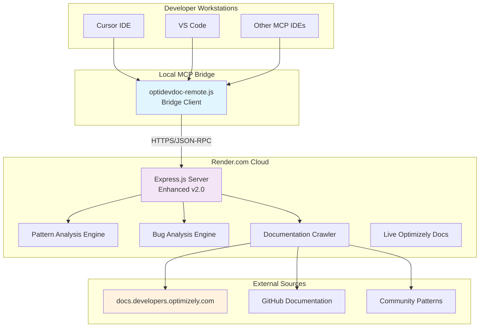
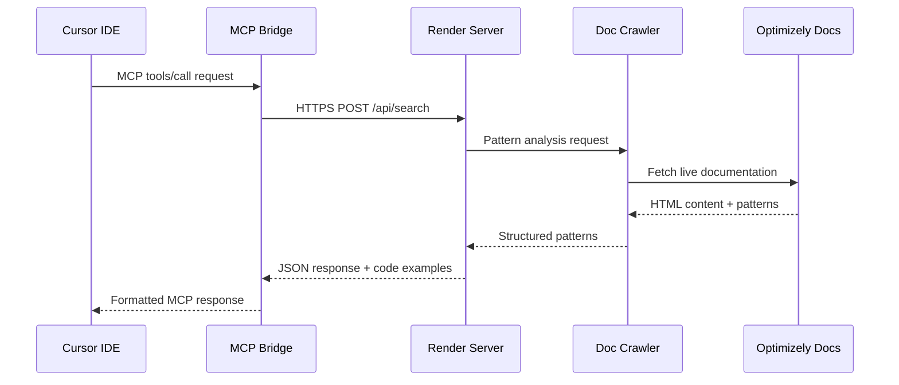
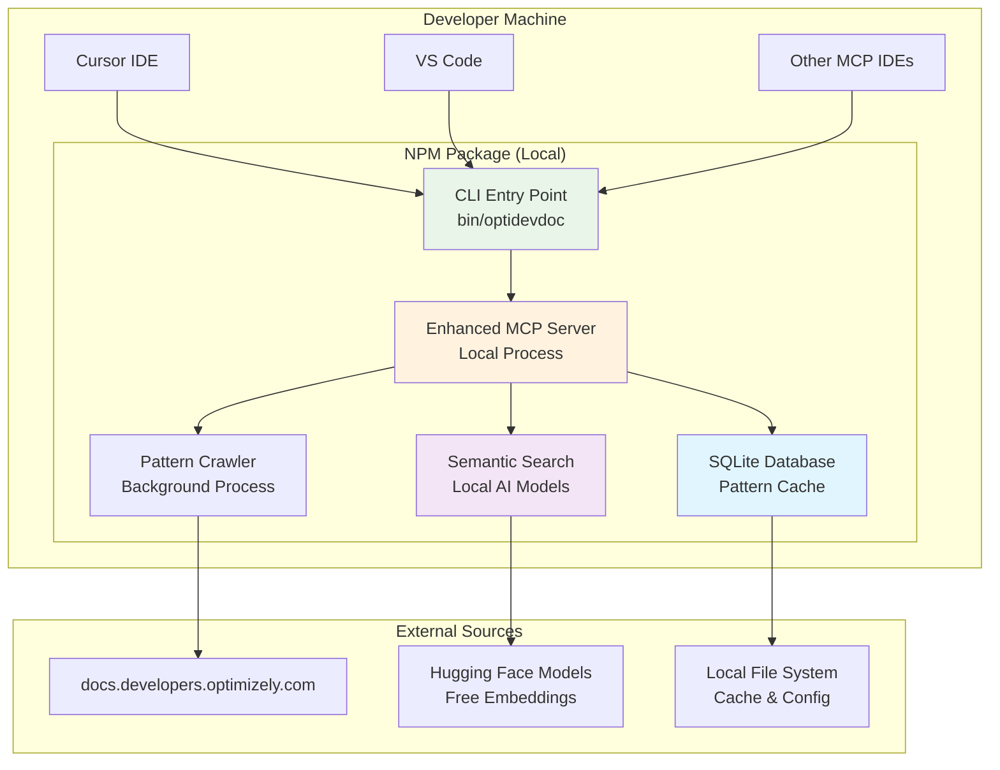
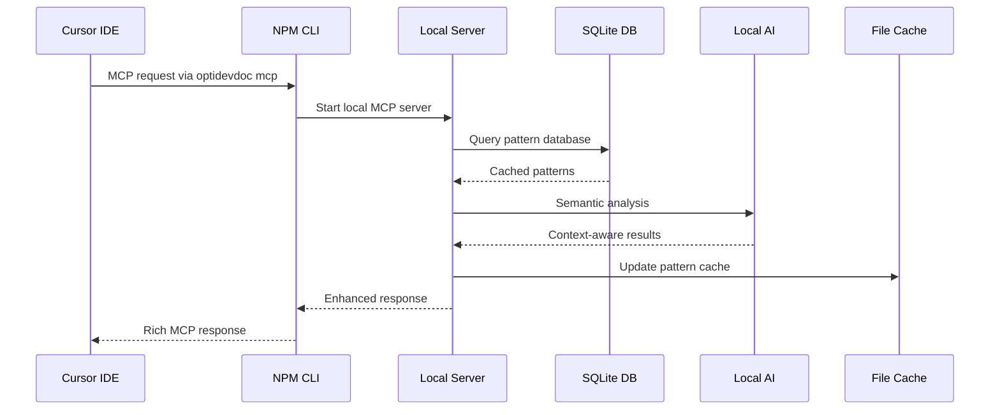
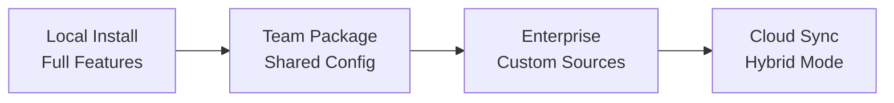
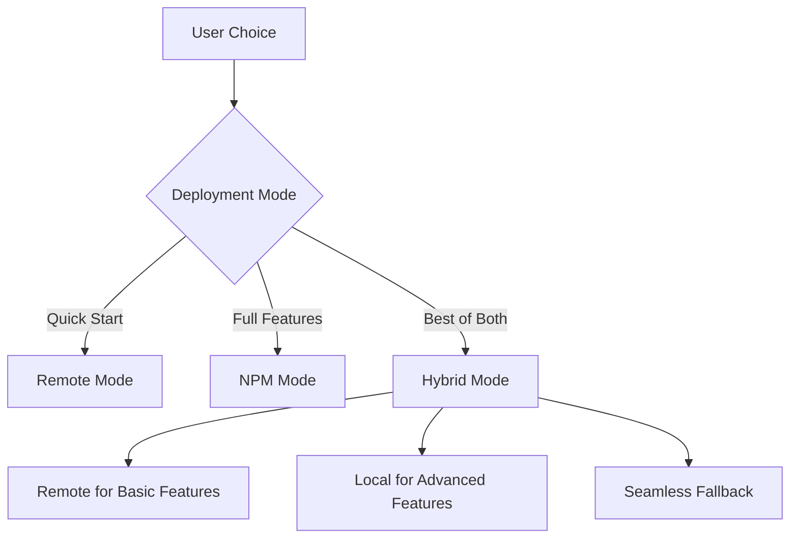

# OptiDevDoc - Dual Deployment Architecture

## 🎯 **System Overview**

OptiDevDoc supports **two distinct deployment modes**, each with different architectural approaches optimized for different use cases:

1. **🌐 Remote Mode**: Zero-setup team deployment via Render.com
2. **📦 NPM Mode**: Local installation with enhanced features

---

## 🌐 **Remote Deployment Architecture**

### **Overview**
Zero-configuration deployment where teams download a single MCP bridge file and connect to hosted server.

### **Architecture Diagram**


### **Data Flow**


### **Remote Mode Components**

| Component | Technology | Purpose | Status |
|-----------|------------|---------|---------|
| **MCP Bridge** | Node.js client | Protocol translation | ✅ **Active** |
| **Express Server** | TypeScript/Express | API endpoints | ✅ **Deployed** |
| **Pattern Engine** | Custom crawler | Real-time pattern extraction | ✅ **Working** |
| **Bug Analyzer** | Rule-based engine | Optimizely-specific debugging | ✅ **Working** |
| **Documentation** | Live crawling | docs.developers.optimizely.com | ✅ **Active** |

### **Remote Mode Benefits**
- ✅ **Zero Setup**: Download one file, add IDE configuration
- ✅ **Team Distribution**: Share single bridge file across team
- ✅ **Auto Updates**: Server updates without client changes
- ✅ **Zero Cost**: Free tier hosting
- ✅ **Always Online**: 24/7 availability with auto-wake

---

## 📦 **NPM Package Architecture**

### **Overview**
Local installation providing full feature set with enhanced capabilities and offline functionality.

### **Architecture Diagram**  


### **NPM Mode Data Flow**


### **NPM Mode Components**

| Component | Technology | Purpose | Local Features |
|-----------|------------|---------|----------------|
| **CLI Interface** | Node.js binary | Global commands | `optidevdoc mcp`, `serve`, `setup` |
| **Local Server** | TypeScript/Express | Enhanced MCP server | Full feature set |
| **SQLite Database** | better-sqlite3 | Pattern persistence | Offline capability |
| **Semantic Search** | Hugging Face | AI-powered search | Zero API costs |
| **Background Crawler** | Scheduled jobs | Auto-update patterns | Smart caching |
| **Configuration** | JSON/YAML | User preferences | `~/.optidevdoc/config` |

### **NPM Mode Benefits**
- ✅ **Full Feature Set**: All capabilities available locally
- ✅ **Offline Mode**: Works without internet after initial setup
- ✅ **Performance**: No network latency, local processing
- ✅ **Customization**: User-specific configuration and caching
- ✅ **Privacy**: No data sent to external servers
- ✅ **Advanced AI**: Local models for semantic search

---

## 🔄 **Deployment Mode Comparison**

### **Feature Matrix**

| Feature | Remote Mode | NPM Mode | Notes |
|---------|-------------|----------|-------|
| **Setup Complexity** | ⭐ Minimal | ⭐⭐ Moderate | Remote: 1 file. NPM: `npm install -g` |
| **Feature Set** | ⭐⭐⭐ Basic | ⭐⭐⭐⭐⭐ Complete | NPM has all advanced features |
| **Performance** | ⭐⭐ Network | ⭐⭐⭐⭐⭐ Local | NPM faster, no network calls |
| **Offline Support** | ❌ None | ✅ Full | NPM works offline |
| **Team Distribution** | ✅ Excellent | ⭐⭐ Manual | Remote easier to share |
| **Resource Usage** | ✅ Zero local | ⭐⭐ Moderate | NPM uses local CPU/memory |
| **Customization** | ⭐ Limited | ⭐⭐⭐⭐⭐ Extensive | NPM allows full configuration |

### **Use Case Recommendations**

#### **Choose Remote Mode When:**
- ✅ **Quick Team Onboarding**: Need immediate access for multiple developers
- ✅ **Resource Constraints**: Limited local machine resources
- ✅ **Simplicity Priority**: Want zero maintenance and configuration
- ✅ **Occasional Usage**: Don't need Optimizely assistance daily

#### **Choose NPM Mode When:**
- ✅ **Heavy Usage**: Daily Optimizely development work
- ✅ **Advanced Features**: Need semantic search, caching, offline mode
- ✅ **Performance Critical**: Can't tolerate network latency
- ✅ **Privacy Requirements**: Keep all data local
- ✅ **Customization Needs**: Want to configure behavior and caching

---

## 🏗️ **Technical Implementation Details**

### **Remote Mode Technical Stack**
```yaml
Infrastructure:
  Hosting: Render.com (Free Tier)
  Runtime: Node.js 20+
  Framework: Express.js + TypeScript
  
Communication:
  Protocol: MCP over HTTPS
  Format: JSON-RPC 2.0
  Transport: HTTP POST
  
Data Sources:
  Primary: docs.developers.optimizely.com
  Cache: In-memory (server restart clears)
  Patterns: Real-time extraction
```

### **NPM Mode Technical Stack**
```yaml
Installation:
  Distribution: npmjs.com
  Binary: Global CLI command
  Dependencies: Bundled (zero external deps)
  
Local Server:
  Runtime: Embedded Node.js server
  Database: SQLite with FTS5
  AI: Hugging Face Transformers.js
  
Storage:
  Config: ~/.optidevdoc/config.json
  Cache: ~/.optidevdoc/cache/
  Database: ~/.optidevdoc/patterns.db
```

### **Shared Components**
Both modes share core business logic:

```typescript
// Shared pattern analysis engine
interface PatternAnalyzer {
  analyzeScenario(scenario: string): Promise<OptimizelyPattern[]>;
  findBestPractices(product: string): Promise<BestPractice[]>;
  debugIssue(description: string): Promise<Solution[]>;
}

// Shared MCP tool definitions
const tools = [
  'search_optimizely_docs',
  'find_optimizely_pattern', 
  'analyze_optimizely_bug'
];
```

---

## 📊 **Performance & Scalability**

### **Remote Mode Performance**
- **Cold Start**: 10-30 seconds (Render free tier)
- **Warm Response**: 1-3 seconds
- **Concurrent Users**: ~10-20 (free tier limits)
- **Uptime**: 99%+ (managed infrastructure)

### **NPM Mode Performance**  
- **Startup Time**: 2-5 seconds (first run)
- **Response Time**: <100ms (local processing)
- **Concurrent Usage**: Limited by machine resources
- **Availability**: 100% (offline capable)

### **Scaling Strategies**

#### **Remote Mode Scaling**


#### **NPM Mode Scaling**


---

## 🔒 **Security & Privacy**

### **Remote Mode Security**
- **Transport**: HTTPS encryption
- **Authentication**: None required (public API)
- **Data Privacy**: Query logs not stored permanently
- **Rate Limiting**: Basic protection against abuse

### **NPM Mode Security**
- **Local Processing**: No data sent externally
- **File Permissions**: Standard Node.js file access
- **Network**: Only outbound for documentation updates
- **User Data**: Stored locally with user permissions

---

## 🚀 **Deployment Strategies**

### **Remote Mode Deployment**
```bash
# Automatic deployment via GitHub
git push origin master
# → Triggers Render.com build
# → TypeScript compilation  
# → Express server starts
# → Auto-scaling and health checks
```

### **NPM Mode Deployment**  
```bash
# Publishing to npm registry
npm version patch
npm publish
# → Available globally via npm install -g optidevdoc
# → Users install and run locally
```

### **Hybrid Deployment (Future)**


---

## 📈 **Future Architecture Evolution**

### **Phase 1 (Current): Dual Mode**
- ✅ Remote deployment working
- ✅ NPM package functional
- ✅ Clear separation of concerns

### **Phase 2: Enhanced Features**
- 📋 Real-time collaboration (Remote)
- 📋 Advanced AI models (NPM)
- 📋 Custom pattern libraries (Both)

### **Phase 3: Ecosystem**
- 📋 Plugin architecture
- 📋 Enterprise integrations
- 📋 Multi-cloud deployment options

This dual architecture provides maximum flexibility while maintaining simplicity and performance for different user needs and organizational requirements. 