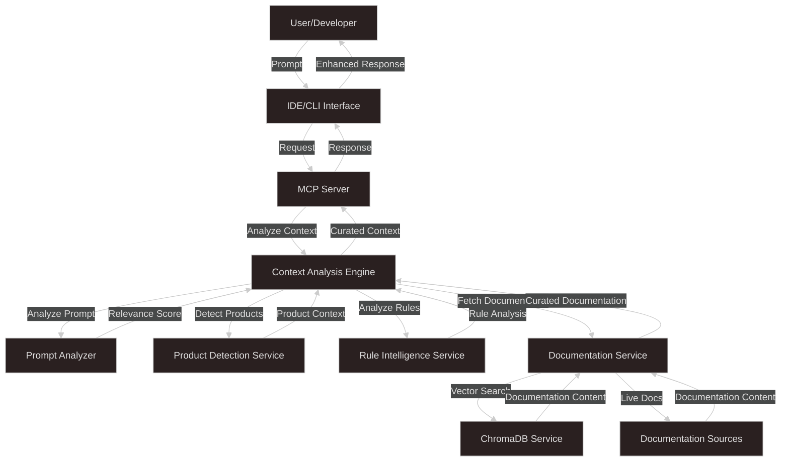
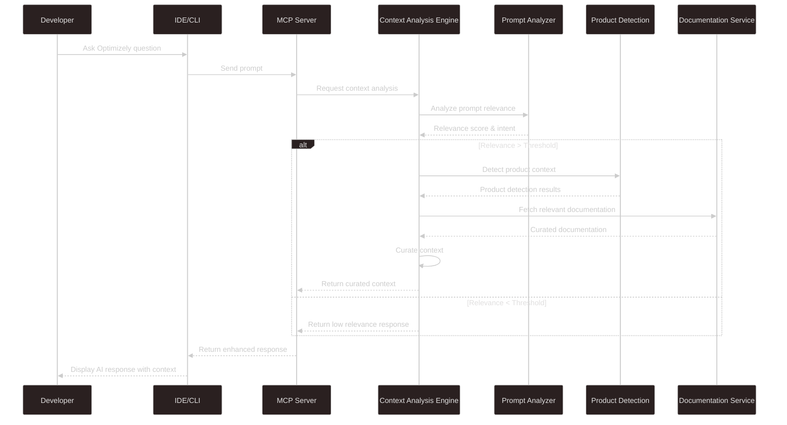
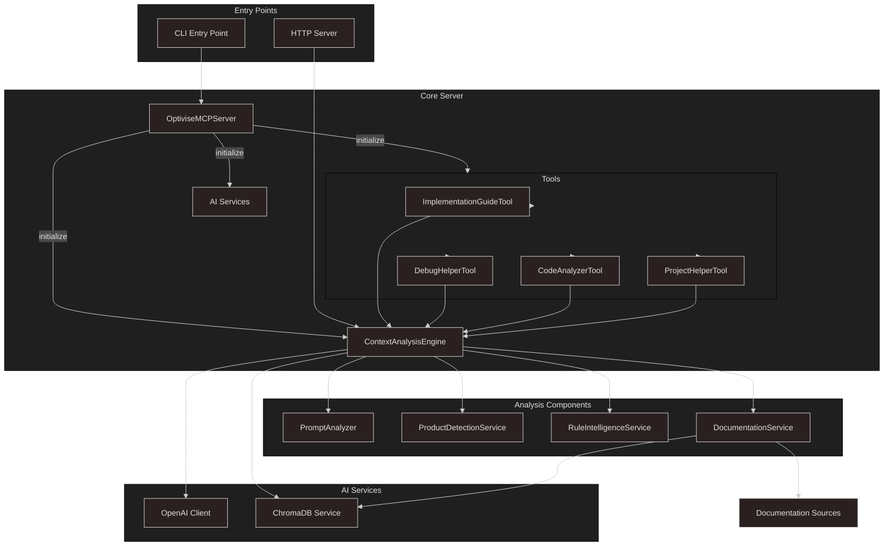
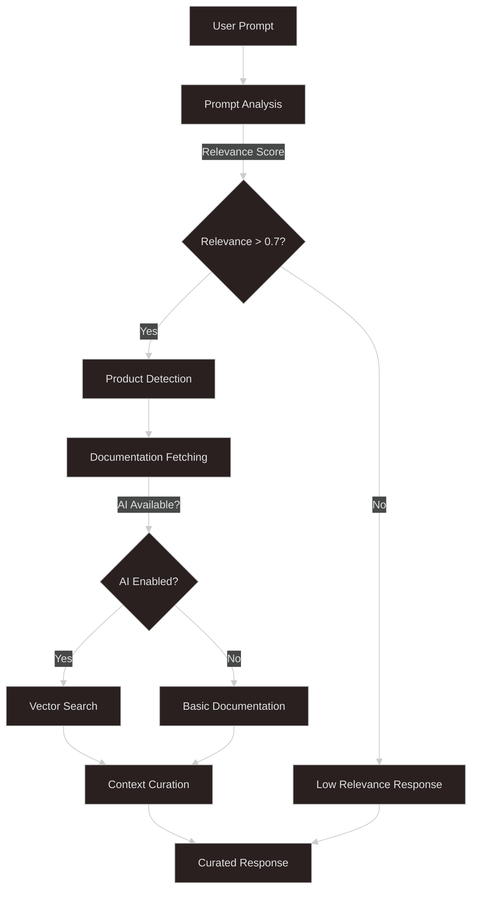

# Optivise Architecture Diagrams

This document provides various diagrams to help understand the architecture and functionality of the Optivise tool.

## Architecture Diagram

## Data Flow Diagram

## How It Works

## Component Connection Diagram

## Deployment Model

## Data Processing Pipeline

