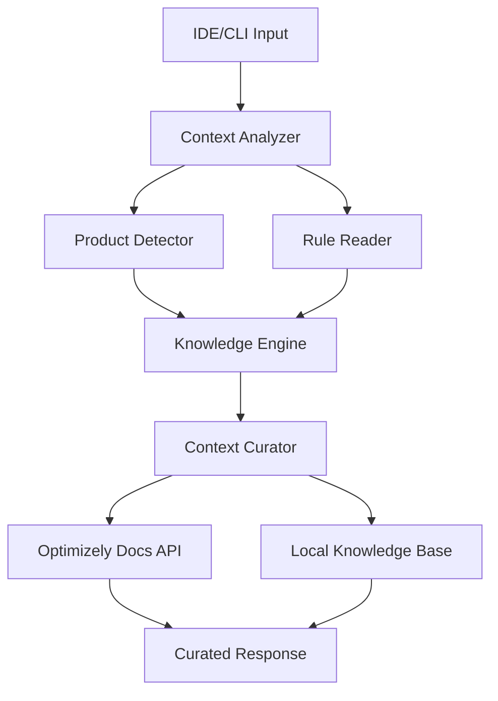

# Optivise - Software Requirements Specification (SRS)

## System Overview

### Architecture Overview

Optivise is an intelligent MCP (Model Context Protocol) tool that provides curated, contextual information about Optimizely products to LLMs based on developer prompts. The system automatically detects Optimizely product contexts and delivers precise, relevant guidance without overwhelming the LLM with irrelevant information.

### Core Components



### Deployment Architecture

1. **NPM Package (Primary)**
   - Full-featured MCP server
   - Local installation and execution
   - Complete product detection
   - Rule learning and storage
   - Live documentation fetching

2. **Render Deployment (Optional)**
   - Lightweight HTTP wrapper
   - Query-based product detection
   - Basic context curation
   - Reduced feature set for simplicity

## Functional Requirements

### 1. Intelligent Product Detection

#### Context-Aware Detection
- **IDE Mode**: Analyze project files, dependencies, and structure
- **CLI/API Mode**: Extract product context from user prompts
- **Multi-Product Support**: Detect multiple Optimizely products in one solution

#### Supported Products
```typescript
interface OptimizelyProducts {
  'configured-commerce': string[],    // Configured Commerce
  'cms-paas': string[],               // Content Management System
  'cmp': string[],                    // Content Marketing Platform  
  'dxp': string[],                    // Digital Experience Platform
  'web-experimentation': string[],    // Web Experimentation
  'feature-experimentation': string[], // Feature Experimentation
  'commerce-connect': string[],       // Commerce Connect
  'data-platform': string[],         // Data Platform
  'connect-platform': string[],      // Connect Platform
  'recommendations': string[]         // Recommendations
}
```

#### Detection Logic
```typescript
interface ProductDetectionResult {
  products: OptimizelyProduct[],
  confidence: number,
  context: 'ide' | 'prompt',
  relevantRules: string[],
  suggestedActions: string[]
}
```

### 2. Rule Intelligence System

#### IDE Rule Reading
- Read `.cursorrules`, `.cursor-rules` files
- Parse VS Code workspace settings
- Extract development patterns from IDE configs
- Analyze existing project rules

#### Rule Analysis & Enhancement
```typescript
interface RuleAnalysis {
  existingRules: IDERule[],
  optimizelyRelevance: number,
  suggestedEnhancements: RuleEnhancement[],
  conflicts: RuleConflict[],
  missing: RequiredRule[]
}
```

#### Knowledge Base Evolution
- Store successful rule applications
- Learn from user interactions
- Build product-specific rule libraries
- Version and distribute rule updates

### 3. Live Documentation Integration

#### Real-Time Documentation Fetching
- Optimizely official documentation
- Learning center content
- Product update announcements
- API documentation and examples

#### Content Curation
- Filter by detected product context
- Extract relevant code snippets
- Summarize key information
- Provide actionable guidance

### 4. Context Curation Engine

#### Relevancy Filtering
- Only respond to Optimizely-related queries
- Score prompt relevance (0-1)
- Ignore non-Optimizely requests
- Provide focused, precise context

#### Response Optimization
```typescript
interface CuratedResponse {
  relevance: number,
  productContext: OptimizelyProduct[],
  actionableInfo: string[],
  codeExamples: CodeSnippet[],
  documentation: DocumentationLink[],
  bestPractices: string[]
}
```

### 5. MCP Integration

#### Protocol Implementation
- Tool registration with IDEs
- Prompt interception and analysis
- Context injection to LLM
- Response formatting

#### IDE Compatibility
- Cursor IDE (primary)
- VS Code
- Other MCP-compatible editors
- Custom integration support

### 6. Knowledge Storage & Learning

#### Local Knowledge Base
- SQLite database for caching
- Rule storage and versioning
- User interaction patterns
- Success story tracking

#### Learning Capabilities
- Pattern recognition from successful solutions
- Rule effectiveness tracking
- Context improvement over time
- User preference learning

## Non-Functional Requirements

### 1. Performance Requirements

#### Response Times
| Operation | NPM Package | Render Deploy | Target |
|-----------|-------------|---------------|---------|
| Startup | <2s | <5s | <3s |
| Context Analysis | <200ms | <500ms | <300ms |
| Product Detection | <500ms | <1s | <800ms |
| Documentation Fetch | <2s | <3s | <2.5s |

#### Resource Usage
- Memory: <256MB base, <512MB with cache
- CPU: <5% average, <15% during analysis
- Storage: <50MB base, <200MB with knowledge base
- Network: Minimal for doc fetching

### 2. Security & Privacy Requirements

#### Data Protection
- No source code storage or transmission
- Local-only rule learning
- Encrypted documentation cache
- Secure API communications

#### Privacy Considerations
- Optional telemetry with user consent
- Local knowledge base storage
- No personal information collection
- GDPR compliance for EU users

#### Access Control
- File system access limited to project scope
- No network access without user consent
- IDE integration sandbox compliance
- API rate limiting (1000 requests/hour)

### 3. Reliability Requirements

#### Availability
- Graceful degradation when offline
- Fallback to cached documentation
- Error recovery mechanisms
- 99.9% operational reliability

#### Data Integrity
- Rule versioning and rollback
- Documentation cache validation
- Knowledge base backup/restore
- Corruption detection and repair

### 4. Maintainability Requirements

#### Code Quality
- Modern TypeScript (ES2022+)
- Clean architecture principles
- Comprehensive documentation
- >80% test coverage target

#### Deployment
- Zero-configuration NPM installation
- Automatic dependency management
- Seamless updates via npm/package managers
- Backward compatibility guarantees

## Technical Constraints

### 1. Development Environment
- Node.js >=18.0.0 (LTS)
- TypeScript native compilation (no Babel)
- MCP protocol compliance
- Cross-platform compatibility (Windows/Mac/Linux)

### 2. IDE Integration Requirements
- MCP protocol support
- File system access for project analysis
- Real-time prompt interception
- Non-intrusive operation

### 3. Technology Stack
- TypeScript with native tsc compilation
- SQLite for local knowledge storage
- Node.js fetch for HTTP requests
- Minimal external dependencies

### 4. Architectural Constraints
- Single unified MCP server architecture
- Feature flags for capability control
- Modular tool system
- Backward-compatible APIs

## Interfaces

### 1. MCP Protocol Interface
```typescript
interface OptiviseTool {
  name: 'optidev_context_analyzer';
  description: 'Analyzes prompts for Optimizely context and provides curated information';
  parameters: {
    type: 'object';
    properties: {
      prompt: {
        type: 'string';
        description: 'User prompt to analyze for Optimizely context';
      };
      projectPath?: {
        type: 'string';
        description: 'Optional project path for IDE context';
      };
      ideRules?: {
        type: 'array';
        description: 'Optional IDE rules for context enhancement';
      };
    };
    required: ['prompt'];
  };
}

interface ContextAnalysisResponse {
  relevance: number;              // 0-1 score for Optimizely relevance
  detectedProducts: string[];     // Detected Optimizely products
  curatedContext: {
    summary: string;
    actionableSteps: string[];
    codeExamples: CodeSnippet[];
    documentation: DocumentationLink[];
    bestPractices: string[];
  };
  suggestedRules?: RuleSuggestion[];
}
```

### 2. Product Detection Interface
```typescript
interface ProductDetectionService {
  detectFromProject(projectPath: string): Promise<ProductDetectionResult>;
  detectFromPrompt(prompt: string): Promise<ProductDetectionResult>;
  
  interface ProductDetectionResult {
    products: OptimizelyProduct[];
    confidence: number;
    detectionMethod: 'file-analysis' | 'prompt-analysis' | 'hybrid';
    evidence: DetectionEvidence[];
  }
}
```

### 3. Rule Intelligence Interface
```typescript
interface RuleIntelligenceService {
  analyzeIDERules(rulesPath: string): Promise<RuleAnalysis>;
  enhanceRules(existingRules: IDERule[], context: ProjectContext): Promise<RuleEnhancement[]>;
  learnFromSuccess(interaction: UserInteraction): Promise<void>;
  
  interface RuleAnalysis {
    existingRules: IDERule[];
    optimizelyRelevance: number;
    suggestedEnhancements: RuleEnhancement[];
    potentialConflicts: RuleConflict[];
  }
}
```

### 4. Documentation Service Interface
```typescript
interface DocumentationService {
  fetchLatest(products: OptimizelyProduct[]): Promise<DocumentationContent>;
  searchRelevant(query: string, products: OptimizelyProduct[]): Promise<SearchResult[]>;
  getCachedContent(cacheKey: string): Promise<DocumentationContent | null>;
  
  interface DocumentationContent {
    source: 'optimizely-docs' | 'learning-center' | 'api-docs';
    content: string;
    lastUpdated: Date;
    relevanceScore: number;
  }
}
```

### 5. Knowledge Base Interface
```typescript
interface KnowledgeBaseService {
  storeInteraction(interaction: UserInteraction): Promise<void>;
  learnFromPattern(pattern: SuccessPattern): Promise<void>;
  getRelevantKnowledge(context: QueryContext): Promise<KnowledgeItem[]>;
  
  interface UserInteraction {
    prompt: string;
    detectedProducts: string[];
    providedContext: string;
    userFeedback?: 'helpful' | 'not-helpful';
    successIndicators?: string[];
  }
}
```

### 6. HTTP API Interface (Render Deployment)
```typescript
interface RenderAPIEndpoints {
  '/analyze': {
    POST: {
      body: {
        prompt: string;
        context?: {
          source: 'cli' | 'api' | 'web';
          metadata?: Record<string, unknown>;
        };
      };
      response: ContextAnalysisResponse;
    }
  };
  
  '/health': {
    GET: {
      response: {
        status: 'healthy' | 'degraded';
        version: string;
        availableFeatures: string[];
        lastDocumentationUpdate: string;
      }
    }
  };
}
```

## Implementation Priorities

### Phase 1 (MVP)
1. Basic MCP tool implementation
2. Project-based product detection
3. Simple context curation
4. Core Optimizely product support

### Phase 2 (Enhanced)
1. IDE rule reading and analysis
2. Live documentation fetching
3. Knowledge base learning
4. Advanced context optimization

### Phase 3 (Advanced)
1. Multi-product detection
2. Centralized rule engine integration
3. Success pattern learning
4. Community rule sharing

## Quality Assurance

### Testing Requirements
- Unit tests for all core services (>80% coverage)
- Integration tests for MCP protocol
- End-to-end tests for IDE integration
- Performance benchmarks for response times

### Validation Criteria
- Relevance accuracy >90% for Optimizely queries
- Product detection accuracy >95% for common scenarios  
- Response time <300ms for cached content
- Memory usage <512MB under normal load 