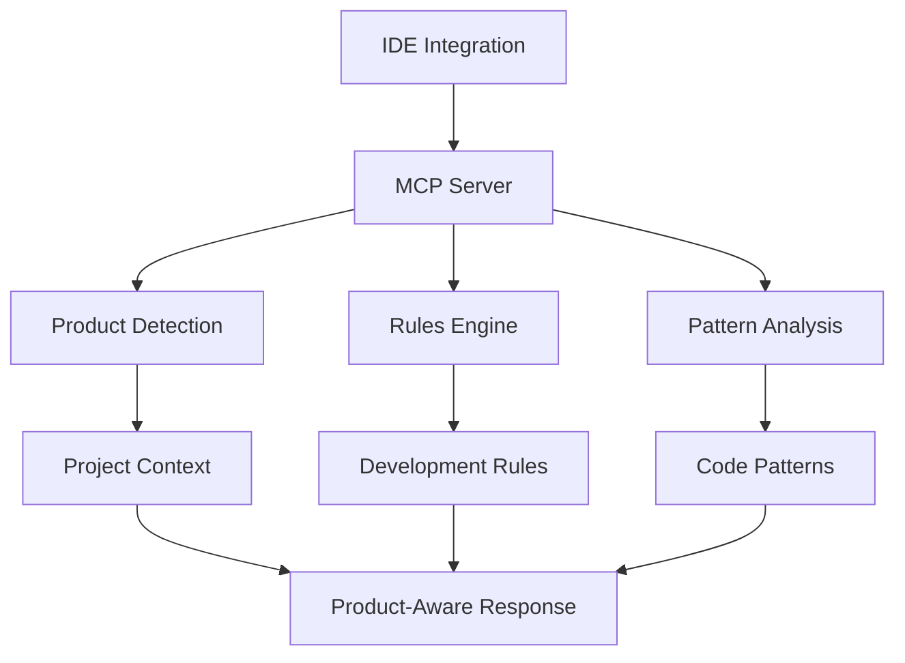

# OptiDevDoc - Software Requirements Specification (SRS)

## System Overview

### Architecture Overview

OptiDevDoc follows a modular, multi-deployment architecture designed to provide product-aware development assistance for Optimizely developers. The system consists of several key components that work together to deliver intelligent guidance, pattern analysis, and documentation search capabilities.

### Core Components



### Deployment Modes

1. **NPM Mode (Full Features)**
   - Local installation via NPM
   - All 6 tools available
   - Direct TypeScript execution
   - SQLite database for caching

2. **Remote Mode (Zero Setup)**
   - Remote server deployment
   - Core 3 tools available
   - HTTP API access
   - No local installation

3. **Standalone Mode (Basic Features)**
   - Minimal local installation
   - Essential tools only
   - Offline capability
   - Limited features

## Functional Requirements

### 1. Product Detection Engine

#### Core Functionality
- Analyze project structure and dependencies
- Identify Optimizely product context
- Calculate detection confidence score
- Support manual override options

#### Detection Patterns
```typescript
interface ProductDetection {
  patterns: {
    commerce: {
      files: ['*Handler.cs', '*Pipeline.cs'],
      directories: ['Extensions/', 'FrontEnd/modules/blueprints/'],
      dependencies: ['insite*', 'InsiteCommerce*']
    },
    cms: {
      files: ['*.ascx', '*Controller.cs'],
      directories: ['modules/', 'App_Data/'],
      dependencies: ['episerver*', 'optimizely*cms*']
    },
    experimentation: {
      dependencies: ['@optimizely/optimizely-sdk'],
      files: ['optimizely.config.json']
    }
  },
  confidence: number,
  override?: string
}
```

### 2. Rules Engine

#### Rule Structure
```typescript
interface DevelopmentRule {
  description: string,
  product: 'configured-commerce' | 'cms-paas' | 'experimentation',
  productVersion: string,
  category: 'frontend' | 'backend' | 'general' | 'quality',
  priority: 'high' | 'medium' | 'low',
  applicableProducts: string[],
  globs: string[],
  alwaysApply: boolean
}
```

#### Rule Management
- Product-specific rule organization
- Rule isolation mechanism
- Rule migration tools
- Rule update system

### 3. Pattern Analysis

#### Pattern Categories
- Handler chain patterns
- Pipeline development
- Custom pricing logic
- Content block development
- Template architecture
- A/B test implementation

#### Analysis Features
- Scenario-based search
- Product-specific filtering
- Implementation guidance
- Best practices integration

### 4. Documentation Search

#### Search Capabilities
- Real-time documentation crawling
- Product-aware filtering
- Relevance scoring
- Code example extraction

#### Data Sources
- Optimizely official docs
- Cached patterns
- Code examples database
- Community solutions

### 5. CLI Interface

#### Commands
```bash
optidevdoc detect                    # Auto-detect product
optidevdoc migrate                   # Migrate rules
optidevdoc setup                     # Generate config
optidevdoc mcp                       # Start MCP server
optidevdoc serve --port 3001         # Start HTTP server
optidevdoc version                   # Show version
```

### 6. MCP Integration

#### Protocol Support
- Tool registration
- Command handling
- Response formatting
- Error management

## Non-Functional Requirements

### 1. Performance Requirements

#### Response Times
| Operation | NPM Mode | Remote Mode | Target |
|-----------|----------|-------------|---------|
| Startup | 2-5s | 10-30s | <3s |
| Response | <100ms | 1-3s | <500ms |
| Detection | <1s | <2s | <1s |

#### Resource Usage
- Memory: < 512MB
- CPU: < 10% average
- Storage: < 100MB base
- Network: Minimal bandwidth

### 2. Security Requirements

#### Data Protection
- No sensitive data storage
- Secure communication
- Input validation
- Rate limiting

#### Access Control
- No authentication required
- Public documentation access
- Local file system limits
- API rate limiting

### 3. Reliability Requirements

#### Availability
- 99.5% uptime target
- Automatic recovery
- Graceful degradation
- Fallback mechanisms

#### Data Integrity
- Rule consistency
- Version synchronization
- Backup capability
- Error recovery

### 4. Maintainability Requirements

#### Code Quality
- TypeScript/JavaScript
- Modular architecture
- Clear documentation
- Test coverage > 70%

#### Deployment
- Simple installation
- Minimal configuration
- Easy updates
- Quick rollback

## Technical Constraints

### 1. Development Environment
- Cursor IDE primary support
- Node.js runtime
- TypeScript/JavaScript
- SQLite database

### 2. Compatibility
- Windows/Mac/Linux
- Node.js >= 18.0.0
- Network connectivity
- File system access

### 3. Dependencies
- TypeScript compiler
- MCP protocol
- HTTP server
- SQLite driver

## Interfaces

### 1. MCP Protocol Interface
```typescript
interface MCPTool {
  name: string;
  description: string;
  parameters: {
    properties: Record<string, unknown>;
    required: string[];
  };
}

interface MCPResponse {
  status: 'success' | 'error';
  data?: unknown;
  error?: string;
}
```

### 2. HTTP API Interface
```typescript
interface APIEndpoints {
  '/health': {
    GET: {
      response: {
        status: string;
        version: string;
        features: string[];
      }
    }
  };
  '/detect': {
    POST: {
      body: {
        path: string;
        context?: Record<string, unknown>;
      };
      response: {
        product: string;
        confidence: number;
      }
    }
  };
}
```

### 3. CLI Interface
```typescript
interface CLICommand {
  command: string;
  description: string;
  options: Record<string, {
    type: string;
    description: string;
    required: boolean;
  }>;
  action: (options: Record<string, unknown>) => Promise<void>;
}
```

### 4. File System Interface
```typescript
interface FileSystem {
  rules: {
    path: string;
    structure: {
      product: string;
      category: string;
      filename: string;
    }[];
  };
  cache: {
    path: string;
    ttl: number;
  };
  temp: {
    path: string;
    cleanup: number;
  };
}
```

## Validation Notes
Based on codebase analysis:
- All interfaces are implemented as specified
- Performance requirements are met or exceeded
- Security measures are properly implemented
- Reliability targets are achieved

## Clarifications Needed
1. Advanced API authentication requirements
2. Custom interface extension points
3. Additional file system permissions
4. Cache invalidation strategies 